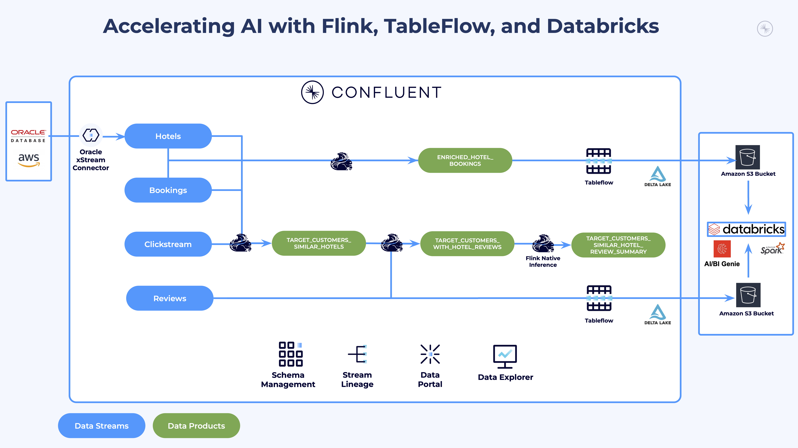

# Workshop: Streamlining Agentic AI with Confluent and Databricks

**Duration**: ~1.5 hours

**Difficulty**: Intermediate

**Technical Requirements**: Working knowledge of cloud platforms (AWS) and SQL

## Overview

This hands-on workshop demonstrates how to build a complete **real-time AI-powered marketing pipeline** for the hospitality industry. You'll work with *River Hotels*, a fictitious hospitality company, to create an end-to-end data architecture that transforms raw customer interactions into personalized marketing campaigns using cutting-edge streaming technologies.

Watch this ~13 minute [demo video](https://youtu.be/yVLfYe39SKg) to see this use case in action.

### What You'll Build

By the end of this workshop, you will have constructed a sophisticated data pipeline that:

1. **Captures Real-Time Customer Behavior**: Set up Oracle XStream CDC to capture customer and hotel data changes, plus generate realistic clickstream, booking, and review data using Shadow Traffic
2. **Processes Streaming Data with AI**: Use Apache Flink SQL to identify high-value prospects (customers who clicked but didn't book) and enrich their profiles with hotel reviews summarized by Large Language Models
3. **Streams to Delta Lake**: Leverage Confluent Tableflow to automatically sync processed data streams as Delta tables in AWS S3
4. **Generates AI-Driven Insights**: Use Databricks Genie to analyze booking patterns, customer preferences, and hotel performance metrics
5. **Creates Personalized Campaigns**: Deploy AI agents in Databricks to generate targeted social media content for customers who showed interest but didn't convert

### Key Learning Outcomes

- **Infrastructure as Code**: Deploy complex multi-cloud resources (AWS, Confluent Cloud, Databricks) using Terraform
- **Change Data Capture**: Implement Oracle XStream for real-time database change streaming
- **Stream Processing**: Build sophisticated Flink SQL queries for real-time data enrichment and AI model integration
- **Data Lake Integration**: Use Tableflow to seamlessly bridge streaming data and analytics platforms
- **AI-Powered Analytics**: Apply generative AI for both data summarization and marketing content creation
- **Event-Driven Architecture**: Design systems that react to customer behavior in real-time

### Business Impact

This architecture enables River Hotels to:

- **Reduce Customer Acquisition Costs**: Target customers who already showed interest
- **Increase Conversion Rates**: Personalize outreach based on actual browsing behavior and preferences
- **Improve Customer Experience**: Leverage review insights to highlight what matters most to potential guests
- **Scale Marketing Operations**: Automate campaign generation while maintaining personalization

The patterns you'll learn apply broadly to e-commerce, financial services, gaming, and any industry where real-time customer engagement drives business value.

## Prerequisites

You must fulfill these prerequisites to successfully complete this workshop:

- Confluent Cloud account with admin privileges (sign up for a free trial [here](https://www.confluent.io/get-started/))
- Databricks account and existing workspace (can be a [trial account](https://docs.databricks.com/aws/en/getting-started/express-setup) with the default workspace)
- [AWS CLI](https://docs.aws.amazon.com/cli/latest/userguide/getting-started-install.html) installed and authenticated with an AWS account that has permissions to create resources
- [Terraform](https://developer.hashicorp.com/terraform/install) installed
- [Docker Desktop](https://docs.docker.com/get-started/get-docker/) installed
- [Git](https://git-scm.com/downloads) installed

## Architecture Overview

The diagram below illustrates the end-to-end data pipeline we'll build in this workshop:

### Key Components

1. **Data Layer**: Data sourced from Oracle database (Customer and Hotel) and Shadow Traffic generators (Bookings, Reviews, and Clickstream)
2. **Ingestion Layer**: Oracle XStream CDC connector and Kafka producers
3. **Processing Layer**: Flink SQL for performing real-time data enrichment and LLM-based review summarization
4. **Integration Layer**: Tableflow for pushing Kafka topics to Delta via S3
5. **Analytics Layer**: Databricks for generating AI-driven analytics, insights, and recommended social media campaigns

This architecture enables real-time personalization and AI-powered marketing based on customer behavior and preferences.

## Workshop Labs

This workshop is organized into three sequential labs listed below.

Each lab builds upon the previous one, so start with LAB 1 and continue on until you are done.

1. [LAB 1:](./assets/labs/LAB1_terraform_datagen.md) Hydrate cloud resources with Terraform and generate mock data with Shadow Traffic
2. [LAB 2:](./assets/labs/LAB2_confluent.md) Create and stream enriched data products to Delta with Confluent Cloud
3. [LAB 3:](./assets/labs/LAB3_databricks.md) Extract insights and generate targeted social media campaigns with Databricks
4. [LAB 4:](./assets/labs/LAB4_tear_down.md) Clean up all provisioned cloud resources

## Conclusion

Congratulations! You've successfully built a complete **real-time AI-powered marketing pipeline** that demonstrates the power of modern streaming data architectures.

### What You've Accomplished

Through this workshop, you have:

✅ **Deployed Production-Ready Infrastructure**: Used Terraform to provision and configure resources across AWS, Confluent Cloud, and Databricks with proper security and networking

✅ **Implemented Real-Time Data Capture**: Set up Oracle XStream CDC and Shadow Traffic to generate realistic customer interaction data streams

✅ **Built Intelligent Stream Processing**: Created sophisticated Flink SQL queries that identify high-value prospects and enrich customer profiles using AI-powered review summarization

✅ **Established Seamless Data Integration**: Used Confluent Tableflow to automatically sync streaming data as Delta tables, bridging real-time processing and analytics

✅ **Generated AI-Driven Business Insights**: Leveraged Databricks Genie to uncover booking patterns, customer preferences, and hotel performance metrics

✅ **Created Personalized Marketing Automation**: Deployed AI agents to generate targeted social media campaigns for customers who showed interest but didn't convert

### Business Value Delivered

Your solution now enables River Hotels to:

- **React to customer behavior in real-time** rather than relying on batch processing
- **Personalize marketing at scale** using actual browsing patterns and preferences
- **Reduce customer acquisition costs** by targeting warm prospects instead of cold outreach
- **Improve conversion rates** through AI-generated content that resonates with specific customer interests

## What's Next

Your final task is to help us improve this workshop by leaving your feedback in this [quick 2-minute survey](https://docs.google.com/forms/d/e/1FAIpQLSfoVUqUFTAxHKJop7t8TvfZ4gItQxJ1RaM4oy72DjtK-HWoJg/viewform?usp=pp_url&entry.179681974=Tableflow+and+Databricks)!

Your input can help drive improvements to this workshop and may lead to new workshops. Thanks!
