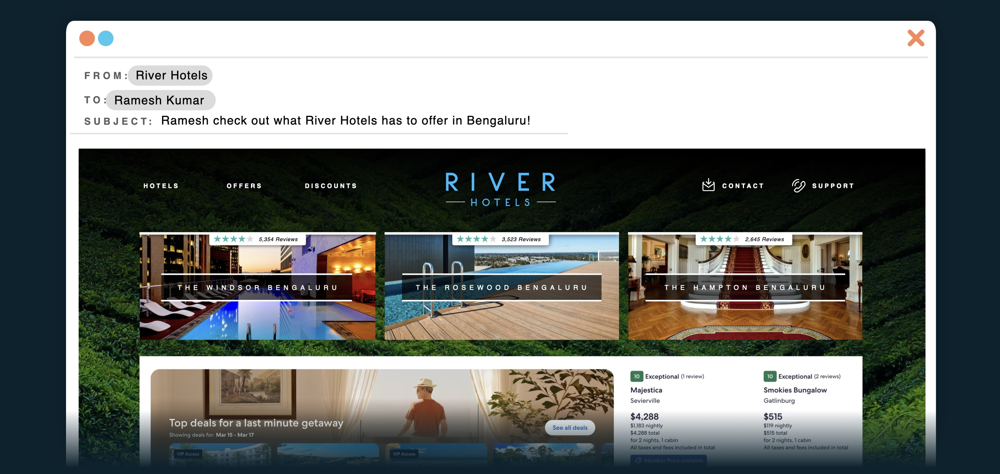
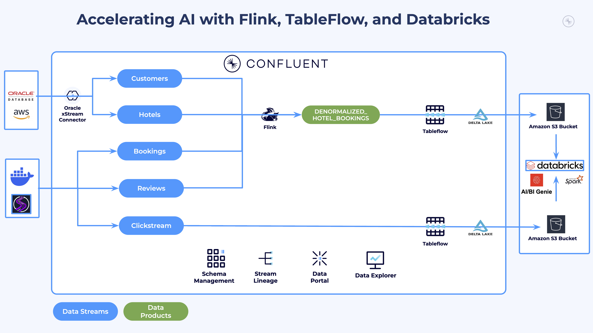
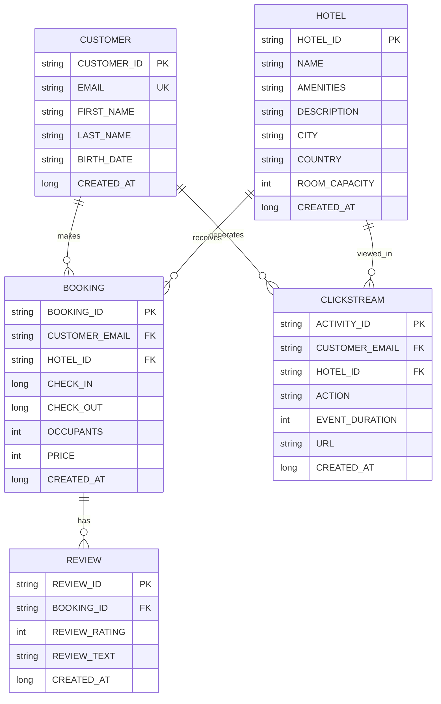

# Workshop: Streamlining Agentic AI with Confluent and Databricks

**Duration**: ~1.5 hours

**Difficulty**: Intermediate

**Technical Requirements**: Working knowledge of cloud platforms (AWS), SQL, and basic command-line operations

## 📖 Overview

This hands-on workshop demonstrates how to build a complete **real-time AI-powered marketing pipeline** for the hospitality industry. You will play the role of a data engineer at *River Hotels*, a fictitious hospitality company, to create an end-to-end data architecture proof-of-concept that transforms raw customer interactions into personalized marketing campaigns using cutting-edge streaming technologies.

Watch this ~13 minute [demo video](https://youtu.be/yVLfYe39SKg) to see the solution to a similar use case.

If you have any issues or feedback for this workshop, Please let us know in this [quick 2-minute survey](https://docs.google.com/forms/d/e/1FAIpQLSfoVUqUFTAxHKJop7t8TvfZ4gItQxJ1RaM4oy72DjtK-HWoJg/viewform?usp=pp_url&entry.179681974=Tableflow+and+Databricks)!

## ✅ Prerequisites

> [!IMPORTANT]
> **Cloud and Region Compatibility**
>
> This workshop is currently only compatible with **AWS** and requires the following services to be available in your chosen region:
>
> - Amazon EC2 (for Oracle database hosting)
> - Amazon S3 (for Delta Lake storage)
> - Amazon Bedrock (OPTIONAL - for AI model access)
> - Amazon VPC (for networking)
>
> **Recommended AWS regions**: us-west-2, us-east-1, us-east-2
>
> If you are going through this workshop with a presenter from Confluent, they should provide additional guidance/limitations for cloud regions as needed.

You must complete each of these in order to successfully go through this workshop:

### Required Accounts

- **Confluent Cloud account** with admin privileges - [sign up for a free trial](https://www.confluent.io/confluent-cloud/tryfree?utm_campaign=tm.fm-ams_cd.Build-an-A[…]ne_id.701Uz00000fEQeEIAW&utm_source=zoom&utm_medium=workshop)
- **Databricks account** and existing workspace - can be a [free trial account](https://docs.databricks.com/aws/en/getting-started/express-setup) OR a [free edition account](https://login.databricks.com/?intent=SIGN_UP&provider=DB_FREE_TIER)
- **AWS account** with permissions to create cloud resources (EC2, S3, VPC, IAM, Bedrock)

> [!WARNING]
> **Payment Method or Promo Code Required for Confluent Cloud**
>
> You must either add a [payment method](https://docs.confluent.io/cloud/current/billing/overview.html#manage-your-payment-method) or [redeem a coupon code](https://docs.confluent.io/cloud/current/billing/overview.html#redeem-a-promo-code-or-view-balance) to be able to run this workshop.

### Required Tools

- **[AWS CLI](https://docs.aws.amazon.com/cli/latest/userguide/getting-started-install.html)** installed and authenticated
- **[Terraform](https://developer.hashicorp.com/terraform/install)** (version >= 1.1.5) installed
- **[Docker Desktop](https://docs.docker.com/get-started/get-docker/)** installed and running
- **[Git](https://git-scm.com/downloads)** installed

### Additional Setup Required

- **Databricks service principal** with appropriate permissions
- **AWS Bedrock access** enabled for Claude models in your chosen region

## 🏨 Use Case

*River Hotels* is at a critical juncture. Despite being a successful hospitality company with properties across multiple continents, they're slowly losing ground to more agile competitors who can respond to market opportunities in real-time. The executive leadership team has identified a fundamental problem: their data infrastructure is holding back their ability to compete effectively in today's fast-paced hospitality market.

### ⚠️ The Challenge

River Hotels' current batch-processing approach means that by the time sales and marketing teams get insights about customer behavior, booking patterns, and market opportunities, those insights are already stale. Competitors could be capturing customers who browse River Hotels' website but don't book immediately, while River Hotels' marketing team is still waiting for last week's data to become available.

As the lead data engineer, you've been called into an urgent cross-departmental meeting where each team has laid out their critical business needs:

---

### 💰 The Sales Dilemma

>*"We're flying blind,"* says the Sales Director. *"When a potential corporate client asks about our occupancy rates or customer satisfaction trends, I have to tell them I'll get back to them next week. By then, they've already signed with our competitor who had those numbers instantly available."*

---

### 🚀 The Marketing Predicament

> The Marketing Manager shares a similarly frustrating story: *"Every week, we try to run a 'discount deal' campaign for an underperforming but highly-rated property. But our current process takes 2-3 days just to identify which hotel needs promotion and another 2 days to analyze, create, review, and publish messaging that resonates with potential guests. By the time we launch the campaign, it's been over a week and the opportunity is lost."*

---

### ⚙️ The Engineering Conundrum

> The Engineering Director is supportive but realistic: *"Whatever solution we build needs to integrate with our existing Oracle database infrastructure and can't require a massive operational overhead. We're already stretched thin, and we need something built on proven, enterprise-grade technology that our small team can actually maintain."*

---

### 💼 The Business Imperative

> The CEO has made it clear: *"We're losing deals because we can't act on opportunities fast enough. Our competitors are using AI and real-time data to personalize customer experiences and optimize their operations. We need to catch up, and we need to do it quickly."*

---

### 🎖️ Your Mission

Your task is to design and implement a proof-of-concept that transforms River Hotels from a data-lagging organization into a real-time, AI-powered competitor.

#### Solution Requirements

1. 📡 **Capture** customer behavior as it happens
2. ✨ **Enrich** data with meaningful insights
3. 🤖 **Process** intelligently with AI
4. 🔓 **Unlock** teams to act on insights immediately

#### 🎯 Success Metrics

1. **💫 Data Freshness** - Moving from week-old batch data to insights that are less than one hour old
2. **⏱️ Operational Efficiency** - Reducing manual data analysis from days to minutes through enriched datasets and automation
3. **🏆 Competitive Advantage** - Responding to market opportunities in real-time rather than after the fact

---

### 🛠️ What You'll Build

By the end of this workshop, you will have constructed a sophisticated data pipeline that:

1. **Captures Real-Time Customer Behavior**: Set up Oracle XStream CDC to capture customer and hotel data changes, plus generate realistic clickstream, booking, and review data using ShadowTraffic
2. **Processes Streaming Data with AI**: Use Apache Flink SQL to identify high-value prospects (customers who clicked but didn't book) and enrich their profiles with hotel reviews summarized by Large Language Models
3. **Streams to Delta Lake**: Leverage Confluent Tableflow to automatically sync processed data streams as Delta tables in AWS S3
4. **Generates AI-Driven Insights**: Use Databricks Genie to analyze booking patterns, customer preferences, and hotel performance metrics
5. **Creates Personalized Campaigns**: Deploy AI agents in Databricks that identify underperforming hotels with good customer satisfaction, generate targeted social media content based on customer review analysis, and create lists of potential customers for marketing outreach

### 🎓 Key Learning Outcomes

- **Infrastructure as Code**: Deploy complex multi-cloud resources (AWS, Confluent Cloud, Databricks) using Terraform
- **Change Data Capture**: Implement Oracle XStream for real-time database change streaming
- **Stream Processing**: Build sophisticated Flink SQL queries for real-time data enrichment and AI model integration
- **Data Lake Integration**: Use Tableflow to seamlessly bridge streaming data and analytics platforms
- **AI-Powered Analytics**: Apply generative AI for both data summarization and marketing content creation
- **Event-Driven Architecture**: Design systems that react to customer behavior in real-time

## 🏛️ Architecture Overview

At a high level, the solution you build is represented by this diagram:

### 🗄 Datasets

There are five normalized interrelated datasets that you will be streaming to Confluent Cloud:

1. **Customers**: Master customer profiles containing contact information and demographics. These records serve as the foundation for customer behavior analysis across all other data streams.

2. **Hotels**: Comprehensive hotel property data including amenities, descriptions, locations, and capacity details.

3. **Clickstream**: Real-time website interaction events capturing customer browsing behavior, page views, and hotel searches.

4. **Hotel Reviews**: Customer feedback with ratings (1-5 stars) and detailed review text, linked to specific bookings.

5. **Bookings**: Reservation transaction data linking customers to hotels with check-in/check-out dates, pricing, and guest counts.

### 🔗 Data Entity Relationship

This diagram depicts how these datasets connect to each other:

### 🧩 Key Components

1. **Data Sources**
   - **Oracle Database**: Customer and Hotel master data with XStream CDC
   - **ShadowTraffic**: Realistic synthetic data generation for Bookings, Reviews, and Clickstream events

2. **Ingestion Layer**
   - **Oracle XStream CDC Connector**: Real-time change data capture from Oracle
   - **Kafka Producers**: Stream synthetic data from ShadowTraffic to Confluent Cloud topics

3. **Processing Layer**
   - **Apache Flink SQL**: Real-time stream processing and data enrichment
   - **AWS Bedrock Integration**: AI-powered review summarization using Claude models
   - **Stream Analytics**: Identification of high-value prospects and customer behavior analysis

4. **Integration Layer**
   - **Confluent Tableflow**: Automated streaming data to Delta Lake format
   - **AWS S3**: Delta Lake storage for processed data streams

5. **Analytics Layer**
   - **Databricks SQL**: Advanced analytics and querying capabilities
   - **Databricks Genie**: Natural language interface for business intelligence
   - **AI Agents**: Intelligent hotel selection, review analysis, and customer targeting for automated marketing campaigns

### 🗂️ Data Flow

1. **Customer and Hotel data** streams from Oracle via XStream CDC
2. **Behavioral data** (clickstream, bookings, reviews) generated by ShadowTraffic
3. **Stream processing** with Flink SQL enriches data and applies AI models
4. **Enriched streams** automatically sync to Delta Lake via Tableflow
5. **Business users** query data and generate AI-powered insights in Databricks

## 🔬 Workshop Labs

This workshop is organized into four sequential labs listed below.

Each lab builds upon the previous one, so start with LAB 1 and continue sequentially until completion.

### [LAB 1: Infrastructure Deployment and Data Generation](./assets/labs/LAB1_terraform_datagen.md)

**Duration**: ~35 minutes

Deploy complete multi-cloud infrastructure using Terraform and establish realistic data generation:

- **Multi-Cloud Infrastructure**: AWS (EC2, S3, VPC), Confluent Cloud, Databricks
- **Oracle Database Setup**: Oracle XE with XStream CDC configuration
- **Data Generation**: ShadowTraffic deployment for realistic hospitality data
- **Security Configuration**: IAM roles, service principals, and network setup

### [LAB 2: Stream Processing and Data Enrichment](./assets/labs/LAB2_confluent.md)

**Duration**: ~20 minutes

Transform raw data streams into intelligent, enriched data products:

- **CDC Integration**: Oracle XStream connector for real-time database changes
- **Stream Processing**: Flink SQL queries for customer behavior analysis
<!-- - **AI Integration**: AWS Bedrock Claude models for review summarization -->
- **Delta Lake Sync**: Tableflow configuration for automated data streaming to S3

### [LAB 3: Analytics and AI-Powered Marketing Automation](./assets/labs/LAB3_databricks.md)

**Duration**: ~25 minutes

Generate actionable insights and AI-powered marketing campaigns:

- **Delta Lake Analytics**: External table creation and querying
- **Business Intelligence**: Databricks Genie for natural language insights
- **Marketing Automation**: AI agent that identifies underperforming hotels, generates social media content based on customer reviews, and creates targeted customer lists
- **End-to-End Validation**: Complete pipeline testing and validation

### [LAB 4: Resource Cleanup](./assets/labs/LAB4_tear_down.md)

**Duration**: ~10 minutes

Responsible cleanup of all provisioned cloud resources:

- **Manual Cleanup**: UI-created resources (connectors, integrations)
- **Automated Cleanup**: Terraform destroy for infrastructure resources
- **Cost Optimization**: Ensure no resources are left running

### Additional Resources

- **[Recap](./assets/labs/recap.md)**: Summary of accomplishments and business value delivered
- **[Troubleshooting](./assets/labs/troubleshooting.md)**: Common issues and solutions

## 🛠️ Technical Stack

### Core Technologies

- **[Terraform](https://terraform.io/)**: Infrastructure as Code for multi-cloud deployment
- **[Apache Kafka](https://kafka.apache.org/)**: Distributed streaming platform via Confluent Cloud
- **[Apache Flink](https://flink.apache.org/)**: Stream processing and real-time analytics
- **[Delta Lake](https://delta.io/)**: Open-source storage framework for data lakes
- **[Oracle XStream](https://docs.oracle.com/en/database/oracle/oracle-database/21/xstrm/)**: Change data capture for real-time data streaming

### Cloud Platforms

- **[AWS](https://aws.amazon.com/)**: Primary cloud provider (EC2, S3, VPC, Bedrock)
- **[Confluent Cloud](https://confluent.io/)**: Fully managed Apache Kafka service
- **[Databricks](https://databricks.com/)**: Unified analytics platform for big data and ML

### AI/ML Services

<!-- - **[AWS Bedrock](https://aws.amazon.com/bedrock/)**: Managed AI service for Claude model access -->
- **[Databricks Genie](https://docs.databricks.com/en/genie/index.html)**: Natural language interface for analytics
- **[Databricks Mosaic AI Models](https://docs.databricks.com/aws/en/machine-learning/model-serving/foundation-model-overview)**: Large, powerful LLMs that can be utilized in custom agents

### Development Tools

- **[Docker](https://docker.com/)**: Containerization for Oracle database and ShadowTraffic
- **[Git](https://git-scm.com/)**: Version control
- **[AWS CLI](https://aws.amazon.com/cli/)**: AWS command-line interface
- **[ShadowTraffic](https://shadowtraffic.io/)**: Realistic synthetic data generation

## 🏁 Conclusion

Please help us improve this workshop by leaving your feedback in this [quick 2-minute survey](https://docs.google.com/forms/d/e/1FAIpQLSfoVUqUFTAxHKJop7t8TvfZ4gItQxJ1RaM4oy72DjtK-HWoJg/viewform?usp=pp_url&entry.179681974=Tableflow+and+Databricks)!

Thanks!
