# LAB 1: Terraform and Data Generation

## Overview

Welcome to the foundation of your real-time AI marketing pipeline! In this first lab, you'll establish the complete infrastructure and data foundation that powers River Hotels' intelligent customer engagement system.

### What You'll Accomplish

By the end of this lab, you will have:

1. **Multi-Cloud Infrastructure Deployment**: Use Terraform to automatically provision and configure resources across AWS, Confluent Cloud, and Databricks with proper security, networking, and integration
2. **Production-Ready Data Platform**: Set up Oracle XE with XStream CDC, Kafka clusters with Schema Registry, Flink compute pools, and Delta Lake storage - all connected and ready for real-time processing
3. **Realistic Data Generation**: Deploy Shadow Traffic to create authentic customer behavior data including clickstreams, bookings, reviews, and customer profiles that mirror real hospitality industry patterns
4. **End-to-End Validation**: Verify that all cloud resources are properly configured and communicating, ensuring your pipeline foundation is solid

## Steps

### Step 1: Clone this Repository

Follow these steps to clone this repository

1. Open your preferred command-line interface, like *zsh* or *Powershell*
2. Clone this repository with git:

   - HTTP

      ```sh
      git clone https://github.com/confluentinc/workshop-tableflow-databricks.git
      ```

   - SSH

      ```sh
      git clone git@github.com:confluentinc/workshop-tableflow-databricks.git
      ```

3. Navigate into the repository's `terraform` directory

   ```sh
   cd workshop-tableflow-databricks/terraform
   ```

### Step 2: Cloud API Keys and Accounts

Terraform enables you to streamline the creation and initial set up of many cloud resources in this workshop.

You can supply and override default Terraform values from a `.tfvars` file.

#### tfvars

Follow these steps to get your `.tfvars` file set up:

1. Copy or rename the `sample-tfvars` file to `terraform.tfvars`

   ```sh
   cp sample-tfvars terraform.tfvars
   ```

2. Open the `terraform.tfvars` in your editor of choice to replace the placeholder values with actual ones

   ```hcl
   # ===============================
   # General Overrides
   # ===============================
   email        = ""
   cloud_region = ""

   # ===============================
   # Confluent Cloud Overrides
   # ===============================
   confluent_cloud_api_key    = ""
   confluent_cloud_api_secret = ""

   # ===============================
   # Databricks Overrides
   # ===============================
   databricks_account_id                      = ""
   databricks_service_principal_client_id     = ""
   databricks_service_principal_client_secret = ""
   databricks_host                            = ""
   databricks_user_email                      = ""
   ```

#### Confluent Account Values

Follow this next section of steps to create a Confluent *Cloud resource management* API key and token.

##### Login and Create API Key and Secret

1. In the web browser of your choice, login to your Confluent cloud account. If you don't yet have one, sign up for a trial [here](https://www.confluent.io/get-started/)
2. Click on the menu icon in the top right of the screen
3. Click on *API keys*
4. Click on the *+ Add API key* button
5. Select *My account*
6. Click *Next*
7. Select *Cloud resource management*
8. Click *Next*
9. Enter a name like *Tableflow Databricks Workshop*
10. Add a useful description
11. Click the *Create API Key* button

##### Add API Key and Secret to Terraform

1. In your code editor of choice, open your `terraform.tfvars` file and enter in the `confluent_cloud_api_key` and `confluent_cloud_api_secret` values from your newly-created **Key** and **Secret**. Save the `terraform.tfvars` file.
2. Back in Confluent Cloud, click the *Download API key* button to prompt your browser to download a text file with your API key, secret, and other useful Confluent information and values
3. Click the *Complete* button

#### Databricks Account Values

There are many values to add from Databricks, and these steps will guide you through it:

##### Sign up/Login

1. Navigate to your databricks account and log in and **ensure your user is a workplace admin**.
2. If you don't have a databricks account, you can create a trial one by selecting the *Express Setup* [here](http://signup.databricks.com/). Your trial user account will be a workspace admin.

##### Create Service Principal

1. Click on your username in the top right bar and select *Settings*
2. Click on *Identity and access*
3. Click the *Manage* button next to *Service principals*

   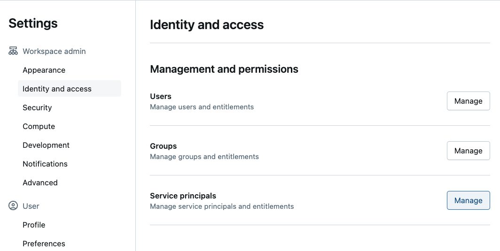

4. Click on the *Add service principal* button
5. Click on the *Add new* button
6. Enter a descriptive name in the textbox, something like *workshop-tableflow-databricks*

   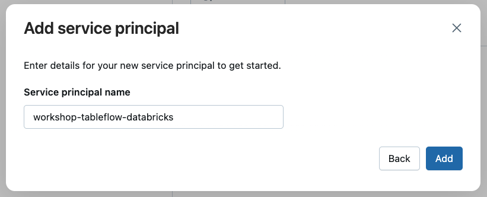

7. Click on the *Add* button

##### Create OAuth Secret for Service Principal

1. Click on your newly-created Service Principal
2. Click on the *Secrets* tab
3. Click on the *Generate secret* button
4. Enter a reasonable duration lifetime, something like `30` or above

   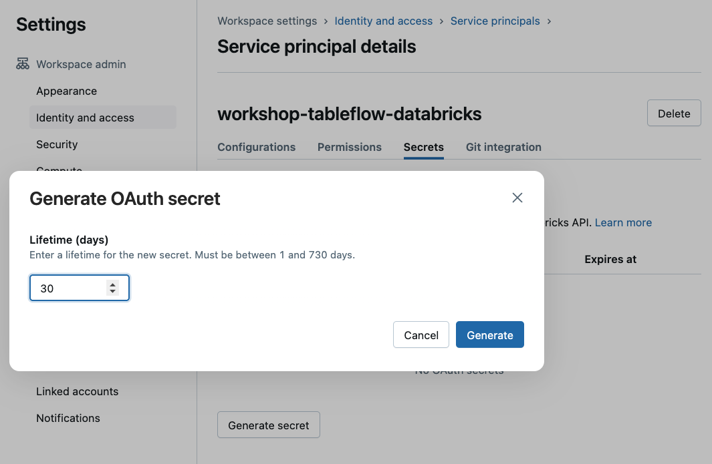

5. Click the *Generate* button
6. Copy and paste the `Secret` and `Client ID` into the corresponding databricks Terraform variables in your `terraform.tfvars` file

   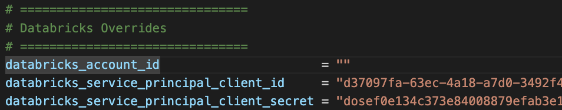

7. Click on the *Done* button

##### Add Service Principal to Admin Group

1. Click on the *Identity and access* link under the *Settings* heading
2. Click on the *Manage* button next to the *Groups* section
3. Click on the *admins* link

   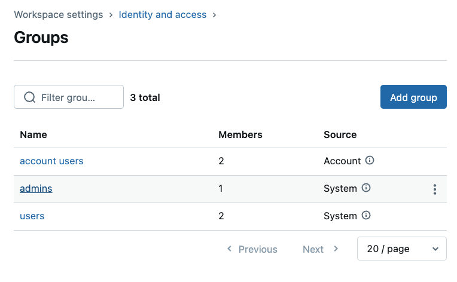

4. Click on the *Add members* button
5. Search for the name of the Service Principal you just created and select it from the dropdown

      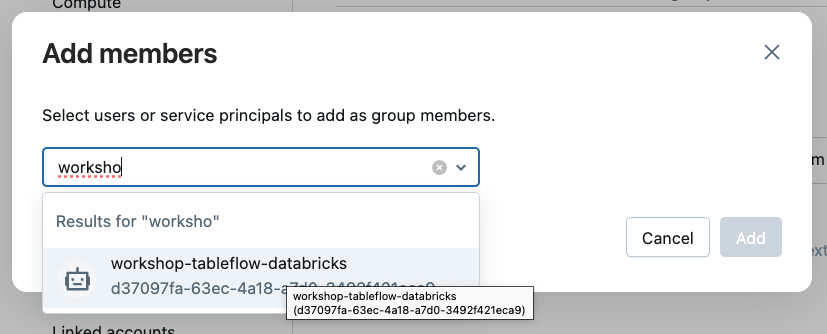

6. Click on the *Add* button

##### Relax Network Policy Access

1. Open a separate browser tab and navigate to the [databricks account manager UI](https://accounts.cloud.databricks.com/)
2. Login with the same account as used in the previous steps (if needed)
3. Click on the *Cloud resources* link the left sidebar
4. Click on the *Network* tab
5. Click on the *Network policies* option
6. Click on the *default policy*
7. Find the *General* section and click on the *Allow access to all destinations*

   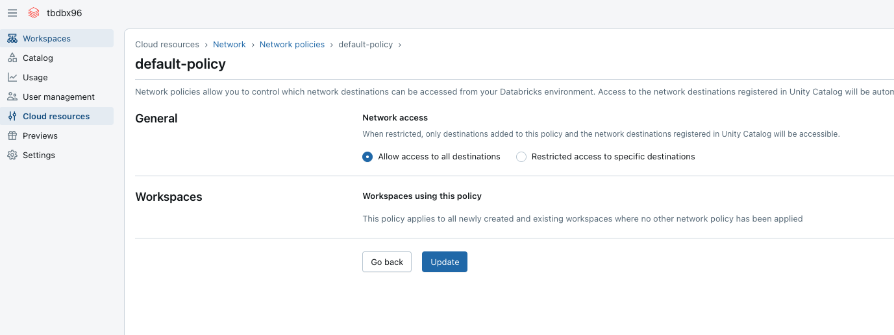

8. Click the *Update* button

##### Get Databricks IDs

1. Click on the *Workspaces* link in the left navigation panel
2. Click on your workspace link (it will be called *workspace* when using a trial account)

   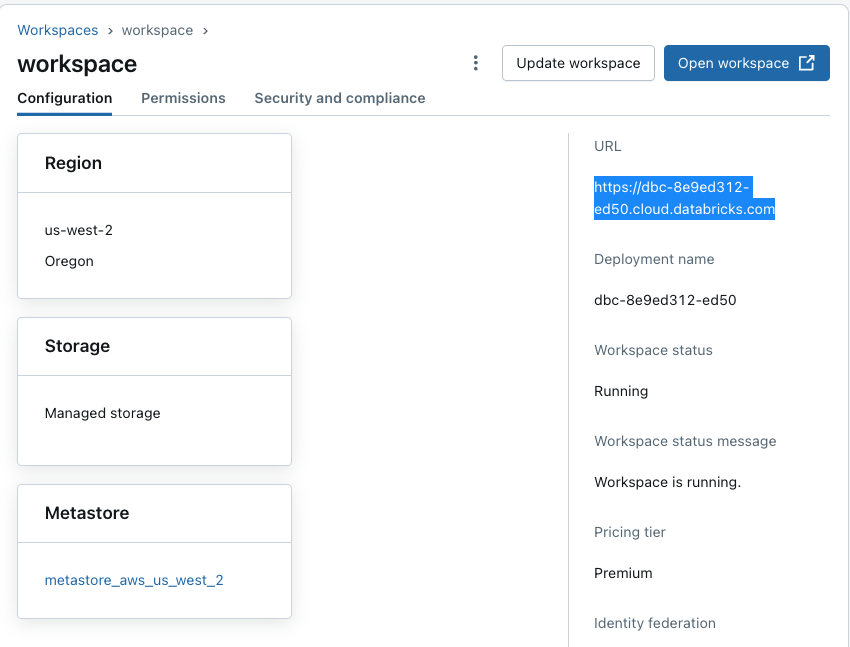

3. Copy the *URL* and paste it into your `terraform.tfvars` for the `databricks_host` variable override
4. Copy the *Region* value (e.g. `us-west-2`, `us-east-2`, etc.) and paste it into your `terraform.tfvars` for the `cloud_region` variable override
5. Click on the account profile circle in the top right of the screen

   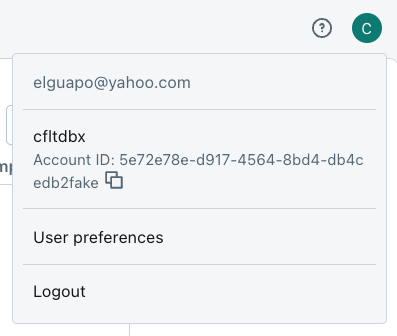

6. Copy your account's email address and paste it into your `terraform.tfvars` for the `databricks_user_email` variable override
7. You can paste the same email address in the `email` variable override in `terraform.tfvars` or you can paste a different one.
8. Copy the *Account ID* value and paste it into your `terraform.tfvars` for the `databricks_account_id` variable override

Congratulations, You have added all the required values from your Confluent and Databricks accounts!

Save you `terraform.tfvars` file. It should look somewhat like this:

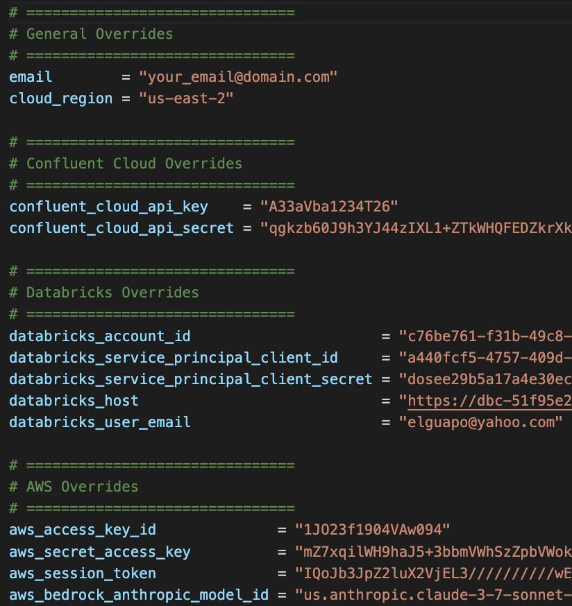

Now it's time for you to perform some deployment magic 🪄🎩

### Step 3: Deploy Cloud Infrastructure with Terraform

The `terraform` commands below will set up, validate, and create the cloud resources for this workshop.

First, initialize your Terraform by running this command:

```sh
terraform init
```

You should see this success message in your shell:
> Terraform has been successfully initialized!

Next, verify that your Terraform configuration is valid by executing this command:

```sh
terraform validate
```

You should see this success message in your shell:
> Success! The configuration is valid.

Finally, initiate cloud resource creation by invoking this command:

```sh
terraform apply -auto-approve
```

You should see an extensive log output in your shell showing the progress of generating the  cloud resources.  When finished, you should see a message like this:

> Apply complete! Resources: 43 added, 0 changed, 0 destroyed.

Here is a summary of the main cloud resources you will create through Terraform:

- **AWS**
  - A VPC with necessary networking components
  - An EC2 instance running Oracle XE with XStream enabled
  - An S3 bucket to store Delta table data
- **Confluent Cloud**
  - An Environment
  - A *Standard* Kafka cluster
  - Schema Registry enabled
  - A Flink compute pool
  - A Provider Integration with AWS for Tableflow
- **Databricks**
  - An External Storage Location
  - A Storage Credential

When the deployment completes, Terraform will output helpful cloud resource values to your shell. You can view them at any time by running this command within your root Terraform directory:

```sh
terraform output
```

> [!NOTE]
> **Time Duration for Resource Start Up**
>
> It may take **5-10 minutes** for some cloud resources, like the Oracle database on EC2, to finish initializing and start running. If you get any errors where the cloud resource isn't available or listening, then wait a few minutes and try again.

### Step 4: Verify Cloud Resources

Now is a good time to verify that the cloud resources we created via Terraform are accessible to us and working as expected.

#### Verify AWS Resources

1. Log into the AWS console with the same account you used in Terraform
2. Select the same *cloud region* as you have in Terraform
3. **Ensure EC2 Instance is running**
   1. Navigate to the EC2 home page
   2. Click on *Instances* in the left navigation
   3. Search for the name of your instance (it should contain your AWS username)
   4. Click on the link for it
   5. Check that it is running

   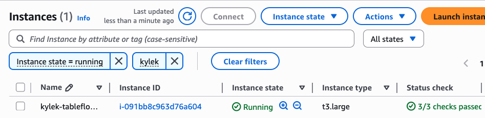

4. **Ensure S3 Bucket is available**
   1. Navigate to the S3 home page
   2. Search for your bucket under the *General purpose buckets* section
   3. Verify that the bucket exists and is empty

   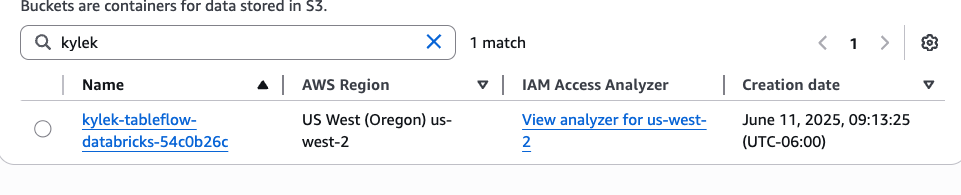

#### Verify Databricks Resources

Follow these steps in a separate browser tab to verify that your Databricks cloud resources work:

##### Test External Location

1. Click on the *Catalog* link in the left navigation panel
2. Click on the gear icon in the top right of the Catalog panel

   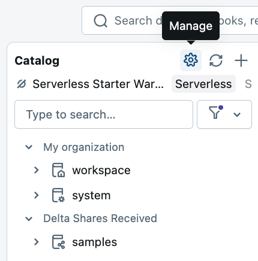

3. Click on *External Locations*
4. Click on the *Name* link of the External Location created by Terraform
5. Click on the *Test connection* button in the top right of the screen
6. You should see a message like this

   

##### Validate Storage Credential

1. Click on the *Credential* link
2. Click on the *Validate Configuration* button
3. You should see a success message like this:

 to generate *River Hotel* data streams using a three-stage approach that creates both historical and streaming data.

#### Data Generation Key Features

- **Sequential execution**: Seed data → Historical data → Streaming data
- **Historical timestamps**: Random distribution over past 8 weeks (Kafka) or fixed 10 weeks ago (Oracle)
- **Customer behavior modeling**: 80% of activities/bookings come from repeat customers
- **Data relationships**: Reviews reference actual bookings, activities reference real hotels/customers
- **Realistic throttling**: Variable delays simulate real-world user behavior patterns

#### Data Generation Stages

1. **Stage 0: Configuration**
   1. The `shadow-traffic-configuration.json` file contains a three-sequential-stage approach to generate both a batch of historical data and periodic ongoing streaming data
   2. Connections to Oracle and Confluent Cloud are prebuilt
2. **Stage 1: Seed Data (Oracle Database)**
   1. The `customer` data generator creates 20,000 customer records with timestamps of 10 weeks ago
   2. The `hotel` data generator invents 500 hotel records across 9 countries with timestamps o 10 weeks ago
3. **Stage 2: Historical Data (Kafka Topics)**
   1. **Activity Generator (Historical)** - Generates 10,000 clickstream events with random timestamps over the past 8 weeks
   2. **Booking Generator (Historical)** - Generates 800 booking records with random timestamps over the past 8 weeks
   3. **Review Generator (Historical)** - Generates 400 hotel reviews with random timestamps over the past 8 weeks
4. **Stage 3: Streaming Data (Kafka Topics)**
   1. **Clickstream Generator (Streaming)** - Produces messages every 7-13 seconds to the `clickstream` topic with a maximum of 800 events
      - References customer emails and hotel IDs from Oracle data
      - 80% of clickstream activity come from existing customers, 20% from anonymous users
   2. **Booking Generator (Streaming)** - Produces messages every 28-51 seconds to the `bookings` topic with a maximum of 50 events
      - Ensures that 20% of customers never appear in bookings
      - References customer emails and hotel IDs from Oracle data
   3. **Review Generator (Streaming)** - Produces messages every 58-81 seconds to the `hotel_reviews` topic up to a max of 25 events
      - Ensures all reviews have ratings between 3-5
      - References customer emails, hotel IDs and booking IDs from streaming bookings

Now all you have to do is run the Shadow Traffic docker container from the workshop's root directory with this command:

**Linux/Mac**

```sh
docker run --env-file ./data/shadow-traffic-license.env -v "$(pwd)/data/:/home/data" shadowtraffic/shadowtraffic:latest --config /home/data/shadow-traffic-configuration.json --watch
```

**Windows cmd**

```sh
docker run --env-file ./data/shadow-traffic-license.env -v "%cd%/data/:/home/data" shadowtraffic/shadowtraffic:latest --config /home/data/shadow-traffic-configuration.json --watch
```

**Windows Powershell**

```sh
docker run --env-file ./data/shadow-traffic-license.env -v "${PWD}/data/:/home/data" shadowtraffic/shadowtraffic:latest --config /home/data/shadow-traffic-configuration.json --watch
```

This will run the data generator in the foreground of your shell.

You should briefly see this output showing that it was successful in connecting to the data ingestion layer and pushing data to it:

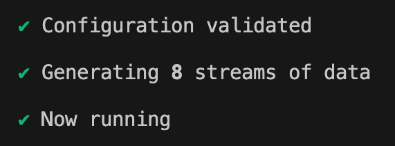

## Conclusion

🎉 **Congratulations!** You've successfully built the complete infrastructure foundation for River Hotels' AI-powered marketing pipeline!

### What You've Achieved

In this lab, you have:

✅ **Deployed Production-Scale Infrastructure**: Provisioned 40+ cloud resources across three platforms using Infrastructure as Code
✅ **Established Real-Time Data Capture**: Set up Oracle XStream CDC to stream database changes instantly
✅ **Validated Multi-Cloud Integration**: Confirmed that AWS, Confluent Cloud, and Databricks are properly connected and secured

### Your Data Foundation

You now have a robust data platform consisting of:

- **20,000 customer profiles** with basic contact information
- **500 hotel properties** across 9 countries with amenities
- **Continuous clickstream data** showing customer browsing behavior
- **Booking transactions** with customer-hotel relationships
- **Hotel reviews** with somewhat random ratings and predetermined feedback

## What's Next

Your epic Confluent + Databricks journey continues in **[LAB 2: Confluent](./LAB2_confluent.md)** where you will:

1. **Connect Oracle to Kafka**: Configure the XStream connector to stream database changes to Confluent Cloud
2. **Build Intelligent Stream Processing**: Use Flink SQL to identify high-value prospects and enrich customer profiles with AI-powered review summaries
3. **Create Data Products**: Transform raw streams into business-ready datasets that drive marketing decisions
4. **Enable Delta Lake Integration**: Set up Tableflow to automatically sync your processed streams as Delta tables for analytics

## Troubleshooting

You can find potentially common issues and solutions or workarounds in the sections below.

### Terraform

#### Handling Provider Integration Deletion Conflicts

If you encounter a `409 Conflict` error when running `terraform destroy -auto-update` to destroy the workshop cloud resources then follow these additional steps:

1. Remove the problematic resource from Terraform state:

   ```sh
   terraform state rm confluent_provider_integration.s3_tableflow_integration
   ```

> ![NOTE]
> **Terraform State Removal**
>
> This command removes the resource from Terraform's state file but does **not** delete the actual resource from Confluent Cloud. The resource will be force-removed when the Confluent Environment gets deleted in the next step.

2. Rerun the terraform destroy command

   ```sh
   terraform destroy -auto-update
   ```

### Oracle Database

If you are experiencing issues with the Oracle database, then you can follow these steps to get into the running container.

1. Find the right commands to run from this terraform output:

   ```sh
   terraform output oracle_vm
   ```

2. Connect to the Oracle instance using the SSH command from the Terraform output in the above step:

   ```sh
   ssh -i sshkey-[YOUR_KEY_NAME].pem ec2-user@[YOUR_INSTANCE_DNS]
   ```

> ![NOTE]
> **Key Fingerprint**
>
> If prompted to add the key fingerprint to your known hosts, enter `yes`.

3. Verify that Oracle XStream is correctly configured:

   ```sh
   sudo docker exec -it oracle-xe sqlplus system/Welcome1@localhost:1521/XE
   ```

4. Verify the XStream outbound server exists inside of SQL\*Plus:

   ```sql
   SELECT SERVER_NAME, CAPTURE_NAME, SOURCE_DATABASE, QUEUE_OWNER, QUEUE_NAME FROM ALL_XSTREAM_OUTBOUND;
   ```

   You should see an entry for the "xout" server that is `XEPDB1`
