# LAB 1: Infrastructure Deployment and Data Generation

## 🗺️ Overview

Welcome to the foundation of your real-time AI marketing pipeline! In this first lab, you'll establish the complete infrastructure and data foundation that powers River Hotels' intelligent customer engagement system.

### What You'll Accomplish

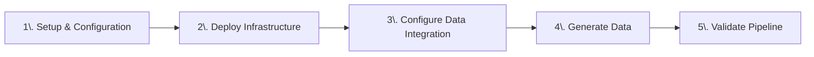

By the end of this lab, you will have:

1. **Multi-Cloud Infrastructure Deployment**: Use Terraform to automatically provision and configure resources across AWS, Confluent Cloud, and Databricks with proper security, networking, and integration
2. **Oracle Data Integration**: Configure Oracle XStream CDC connector to stream customer and hotel data into Confluent Cloud
3. **Realistic Data Generation**: Deploy Shadow Traffic to create authentic customer behavior data including clickstreams, bookings, reviews, and customer profiles that mirror real hospitality industry patterns


### Key Technologies You'll Use

- **Terraform**: Infrastructure as Code for automated multi-cloud resource provisioning and management
- **AWS Services**: EC2 for Oracle hosting, S3 for Delta Lake storage, VPC for networking, and Bedrock for AI model access
- **Oracle XE with XStream CDC**: Enterprise database with real-time change data capture for streaming database changes
- **Confluent Cloud**: Fully managed Apache Kafka platform with Schema Registry and Flink compute pools
- **Databricks**: Unified analytics platform with Delta Lake integration and external storage credentials
- **Shadow Traffic**: Advanced data generation tool for creating realistic, interconnected synthetic datasets

### Prerequisites

Review the [README](../../README.md) and completed its [prerequisites](../../README.md#-prerequisites)

## 👣 Steps

### Step 1: Clone this Repository

Get started by cloning the workshop repository and navigating to the Terraform configuration directory.

1. Open your preferred command-line interface, like *zsh* or *Powershell*
2. Clone this repository with git:

   **HTTP:**

   ```sh
   git clone https://github.com/confluentinc/workshop-tableflow-databricks.git
   ```

   **SSH:**

   ```sh
   git clone git@github.com:confluentinc/workshop-tableflow-databricks.git
   ```

3. Navigate to the Terraform directory:

   ```sh
   cd workshop-tableflow-databricks/terraform
   ```

### Step 2: Configure Cloud API Keys and Accounts

Terraform requires API keys and configuration values to create resources across multiple cloud platforms. You'll configure these values in a `terraform.tfvars` file.

#### Create Terraform Variables File

1. Copy the sample configuration file:

   ```sh
   cp sample-tfvars terraform.tfvars
   ```

2. Open `terraform.tfvars` in your preferred editor

Now you can configure each cloud platform's credentials and settings. It should look like this

```hcl
# ===============================
# General Overrides
# ===============================
email        = ""
cloud_region = ""
call_sign    = ""

# ===============================
# Confluent Cloud Overrides
# ===============================
confluent_cloud_api_key    = ""
confluent_cloud_api_secret = ""

# ===============================
# Databricks Overrides
# ===============================
databricks_account_id                      = ""
databricks_service_principal_client_id     = ""
databricks_service_principal_client_secret = ""
databricks_host                            = ""
databricks_user_email                      = ""
```

You are going to prefix all cloud resources you create through terraform with `call_sign`, so enter a short value for it.

For example, it could be something like `neo` or `whoami`.  Pick something unique and short.

#### Confluent Cloud

Follow this next section of steps to create a Confluent *Cloud resource management* API key and token.

##### Login and Create API Key and Secret

1. Open a web browser tab and login to your Confluent cloud account
   - If you don't yet have one, [sign up for a free trial](https://www.confluent.io/confluent-cloud/tryfree?utm_campaign=tm.fm-ams_cd.Build-an-A[…]ne_id.701Uz00000fEQeEIAW&utm_source=zoom&utm_medium=workshop)
2. Click on the menu icon in the top right of the screen
3. Click on *API keys*

   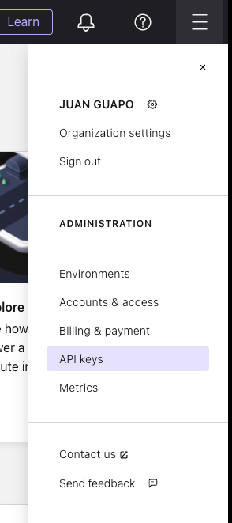

4. Click on the *+ Add API key* button
5. Select *My account*
6. Click *Next*
7. Select *Cloud resource management*

   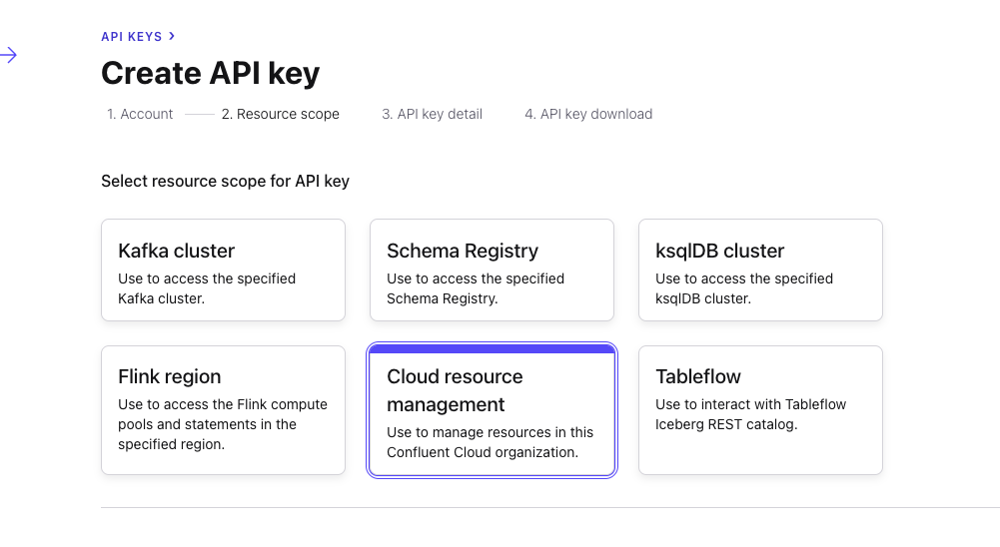

8. Click *Next*
9. Enter a name like *Tableflow Databricks Workshop*
10. Add a useful description
11. Click the *Create API Key* button

##### Add API Key and Secret to Terraform

1. In your code editor of choice, open your `terraform.tfvars` file and enter in the `confluent_cloud_api_key` and `confluent_cloud_api_secret` values from your newly-created **Key** and **Secret**. Save the `terraform.tfvars` file.
2. Back in Confluent Cloud, click the *Complete* button

#### Databricks

There are many values to add from Databricks, and these steps will guide you through it:

##### Sign up/Login

Navigate to [Databricks](https://login.databricks.com/) and login with your account.

> [!NOTE]
> **Create Databricks Account**
>
> If you don't have an existing databricks account, you can create a *recommended* [free trial account](https://login.databricks.com/?intent=signup) (make sure to click the *Continue with Express Setup* button).
>
> Alternatively and not recommended, you can try to use a [free edition account](https://login.databricks.com/?intent=SIGN_UP&provider=DB_FREE_TIER).
>
> Either of these account types should be compatible with the exercises in this workshop, but they each have pros/cons and limitations.

##### Get Databricks IDs

##### Account ID For Paid or Free Trial Accounts

1. Open a separate browser tab to the [Databricks Admin Console](https://accounts.cloud.databricks.com/)
2. Click on the user icon in the top right

   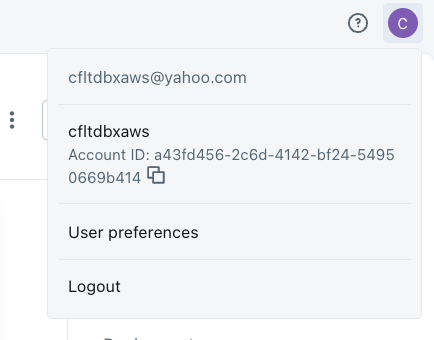

3. Copy the **Account ID** value and paste it into your `terraform.tfvars` file for the `databricks_account_id` key

###### Account ID For Free Edition Accounts

1. Open a separate browser tab to the [Databricks Admin Console](https://accounts.cloud.databricks.com/)
2. Find the `account_id=` in the browser tab url and copy the value

   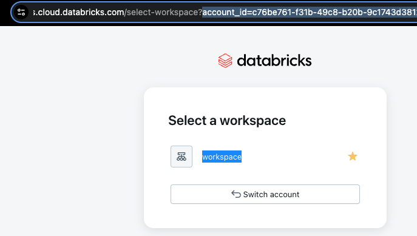

3. Paste it into your `terraform.tfvars` file for the `databricks_account_id` key

###### Additional Databricks IDs

1. Click on the *SQL Editor* link in the left navigation
2. Paste this query into the editor and execute it:

   ```sql
   -- This returns the cloud region where your databricks account resides
   SELECT
      m.metastore_name,
      m.metastore_id,
      m.cloud,
      m.region
   FROM
      system.information_schema.metastores as m;
   ```

3. Copy the *region* value (e.g. `us-west-2`, `us-east-2`, etc.) and paste it into your `terraform.tfvars` for the `cloud_region` variable override. If more than one record is returned, then pick the metastore that's associated with your workspace and use that *region* value

4. Copy the *URL* from your browser address bar and paste it into your `terraform.tfvars` for the `databricks_host` variable override. Erase everything after the *databricks.com*. It should look similar to this: `https://dbc-12f34e56-123e.cloud.databricks.com`

5. Click on the user profile circle in the top right of the databricks screen

   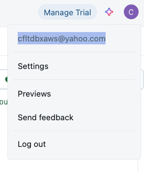

6. Copy your account's email address and paste it into your `terraform.tfvars` for the `databricks_user_email` variable override
7. You can paste the same email address in the `email` variable override in `terraform.tfvars`, or you can paste a different one

##### Create Service Principal

In this step you will create a [Service Principal](https://docs.databricks.com/aws/en/admin/users-groups/service-principals) to authenticate automated tasks, like Terraform, in your Databricks account.

1. Click on your username in the top right bar and select *Settings*
2. Click on *Identity and access*
3. Click the *Manage* button next to *Service principals*

   

4. Click on the *Add service principal* button
5. Click on the *Add new* button
6. Enter a descriptive name in the textbox, something like *workshop-tableflow-databricks*

   

7. Click on the *Add* button

##### Create OAuth Secret for Service Principal

1. Click on your newly-created Service Principal
2. Click on the *Secrets* tab
3. Click on the *Generate secret* button
4. Enter a reasonable duration lifetime, something like `30` or above

   

5. Click the *Generate* button
6. Copy and paste the `Secret` and `Client ID` into the corresponding databricks Terraform variables in your `terraform.tfvars` file

7. Click on the *Done* button

##### Add Service Principal to Admin Group

1. Click on the *Identity and access* link under the *Settings* heading
2. Click on the *Manage* button next to the *Groups* section
3. Click on the *admins* link

   

4. Click on the *Add members* button
5. Search for the name of the Service Principal you just created and select it from the dropdown

   

6. Click on the *Add* button

**Completed Databricks Setup:**

You have completed the Databricks set up and each of the Databricks entries in your `terraform.tfvars` file should be populated with values.

You are now ready to configure your AWS account.

#### AWS

##### Configure AWS Account

With the AWS CLI already installed, follow [these instructions](https://docs.aws.amazon.com/cli/latest/userguide/getting-started-quickstart.html) to configure and authenticate it with your AWS account.

> [!IMPORTANT]
> **AWS Workshop Studio Accounts**
>
> If you are using an AWS Workshop Studio account, click on the **Get AWS CLI credentials** link on your event home screen and follow the instructions for your OS.
>
> Ensure that you set/export the variables in the same shell window that you will be running your terraform commands in.
>
> 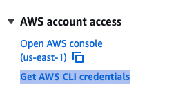

Verify that you are authenticated with the AWS CLI by invoking this command

```sh
aws configure list
```

You should see an output like this:

```sh
 Name                    Value             Type    Location
      ----                    -----             ----    --------
   profile                <not set>             None    None
access_key              ************             env
secret_key              ************             env
    region                **********             env    ******
```

### Step 3: Deploy Cloud Infrastructure with Terraform

Now it's time for you to perform some deployment magic! 🪄🎩

The `terraform` commands below will set up, validate, and create the cloud resources for this workshop.

First, switch to your shell window and navigate to the terraform directory.

Next, initialize Terraform by running this command:

```sh
terraform init
```

You should see this success message in your shell:
> Terraform has been successfully initialized!

Next, verify that your Terraform configuration is valid by executing this command:

```sh
terraform validate
```

You should see this success message in your shell:
> Success! The configuration is valid.

Finally, initiate cloud resource creation by invoking this command:

```sh
terraform apply -auto-approve
```

> [!NOTE]
> **Duration: 5-10 Minutes**
>
> It should take between 5-10 minutes for terraform to completely generate all of the needed cloud resources, so hang tight!
>
> While you wait, you should see an extensive log output in your shell showing the progress of generating the  cloud resources.  When finished, you should see a message like this:
>
> *Apply complete! Resources: XX added, 0 changed, 0 destroyed.*

Here is a summary of the main cloud resources you created through Terraform:

**AWS Resources:**

- VPC with proper networking components
- Security groups with minimal required access
- EC2 instance running Oracle XE database with XStream enabled
- S3 general-purpose bucket to store Delta table data
- IAM roles and policies for secure access

**Confluent Cloud Resources:**

- Environment for workshop isolation
- *Standard* Kafka cluster for data streaming
- Flink compute pool
- Provider Integration with AWS for Tableflow

**Databricks Resources:**

- External Location to access S3 bucket
- Storage Credential for secure access

> [!NOTE]
> **Terraform Output**
>
> When the deployment completes, Terraform will output helpful cloud resource values to your shell. You can view these values at any time by running this command within your root Terraform directory:
>
> ```sh
> terraform output
> ```

> [!IMPORTANT]
> **Troubleshoot Terraform Issues**
>
> If your terraform execution fails, you can [review these common issues](./troubleshooting.md#terraform).

### Step 4: Verify Infrastructure Deployment

Now is a good time to verify that the cloud resources we created via Terraform are accessible to us and working as expected.

#### Verify AWS Resources

1. If logged out, log into the AWS console with the same account you used in Terraform
2. Select the same *cloud region* as you have in Terraform
3. **Ensure EC2 Instance is running**
   1. Navigate to the EC2 home page
   2. Click on *Instances* in the left navigation
   3. Search for the name of your instance (it should contain your AWS username)
   4. Click on the link for it
   5. Check that it is running

   

4. **Ensure S3 Bucket is available**
   1. Navigate to the S3 home page
   2. Search for your bucket under the *General purpose buckets* section
   3. Verify that the bucket exists and is empty

   

#### Verify Databricks Resources

Follow these steps in a separate browser tab to verify that your Databricks cloud resources work:

##### Test External Location

1. Click on the *Catalog* link in the left navigation panel
2. Click on the gear icon in the top right of the Catalog panel

   

3. Click on *External Locations*
4. Click on the *Name* link of the External Location created by Terraform
5. Click on the *Test connection* button in the top right of the screen
6. You should see a message like this

   

##### Validate Storage Credential

1. Click on the *Credential* link
2. Click on the *Validate Configuration* button
3. You should see a success message like this:

   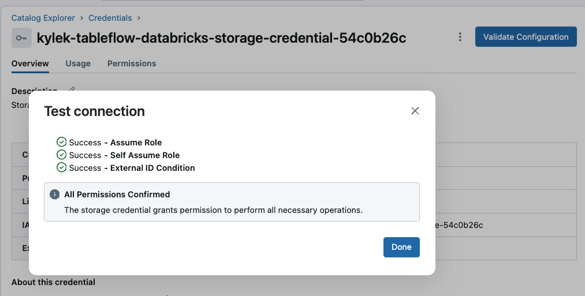

> [!NOTE]
> **Databricks Browser Tab**
>
> Keep this browser tab open as you will be returning to Databricks towards the end of this workshop.

#### Verify Confluent Resources

1. Navigate to your Confluent Cloud account
2. Find and Click on your workshop environment
3. Click on the *Integrations* link in the left menu
4. Notice there is a row under the *Provider* tab that contains the name **tableflow-databricks**. This is the AWS integration that will enable Tableflow to push streams as Delta Lake tables to S3

   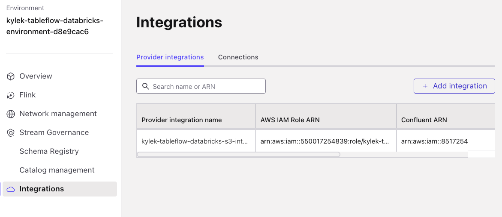

5. Click on *Overview* in the left sidebar menu
6. Click on your workshop Cluster
7. Click on the *Topics* link in the left sidebar menu
8. Notice that there no Topics being produced yet

   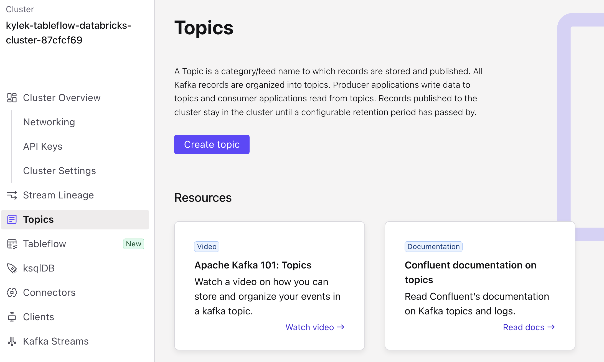

**Huzzah!** - now that you have verified that your workshop cloud resources have been spun up correctly, it's time to generate data!

### Step 5: Configure Oracle XStream Connector

In this section you will configure the Oracle XStream connector to capture real-time changes from your Oracle database and stream them to Confluent Cloud.

#### Navigate to the Oracle XStream Connector

1. Click on *Connectors* in the left sidebar menu
2. Type `XStream` in the *search* text field
3. Select the `Oracle XStream CDC Source Premium` tile (it has the Oracle logo on it)


#### Generate API Key for Connector

1. Select the `My account` tile
2. Click the `Generate API key and download` button

> [!NOTE]
> **Too Many API Keys**
>
> If you too many existing API keys this will fail; remove any unused keys if this occurs
>
> This API key will be deleted automatically along with its Confluent environment at the end of this workshop

3. Click the `Continue` button

> [!TIP]
> **Delete API Credentials File**
>
> You can delete the API credentials file that gets downloaded to your computer as the credentials are automatically mapped to the cluster and connector.

#### Configure Connection and Authentication

Run this Terraform command in your shell to show the values needed to connect and authenticate the Oracle XStream Connector.

```sh
terraform output oracle_xstream_connector
```

Now copy and paste the corresponding values into the text boxes:

1. Enter the `database_hostname` Terraform output into the `Database hostname` textbox
2. Enter the `database_port` Terraform output into the `Database port` textbox
3. Enter the `database_username` Terraform output into the `Database username` textbox
4. Enter the `database_password` Terraform output into the `Database password` textbox
5. Enter the `database_name` Terraform output into the `Database name` textbox
6. Enter the `database_service_name` Terraform output into the `Database service name` textbox
7. Enter the `pluggable_database_name` Terraform output into the `Pluggable database (PDB) name` textbox
8. Enter the `xstream_outbound_server` Terraform output into the `XStream outbound server name` textbox
9. Enter the `1` into the `Total number of Oracle processors to license` textbox

   Your screen should look similar to this:
   

10. Click the `Continue` button on the bottom right

#### Configure Message Formatting and Tables

1. Select `AVRO` on the *Output Kafka record key format* dropdown
2. Select `AVRO` from the *Output Kafka record value format* options
3. Enter `riverhotel` into the *Topic prefix* textbox
4. Enter `SAMPLE[.](HOTEL|CUSTOMER)` into the *Table include list* textbox

    Your screen should look like this:

    

5. Click the `Continue` button

#### Complete the Connector Configuration

1. Enter `1` into the *Max tasks* textbox
2. Click the `Continue` button
3. Configure Connector Name - enter any name you like in the *Connector name* textbox
4. Click the `Continue` button
5. Now this connector could take ~5 minutes to initialize; The connector tile will show **Running** status when it is ready


Well done! You have successfully configured change data capture for all events on the database tables `CUSTOMER` & `HOTEL`, which will automatically be recorded to the corresponding Kafka topics `riverhotel.SAMPLE.CUSTOMER` & `riverhotel.SAMPLE.HOTEL`

#### ✅ Solution Requirements Fulfilled

- **🔌 Seamless Integration** - Oracle XStream CDC now streams database changes in real-time to Confluent Cloud
- **📡 Capture** - Customer and hotel data changes are now captured in real-time from Oracle database

Now that we have data generating to our Oracle database and Kafka topics, let's move on to the next step!

### Step 6: Generate Data

You will use a flexible data-generator tool called [Shadow Traffic](https://shadowtraffic.io/) to generate *River Hotel* data streams using a three-stage approach that creates both historical and streaming data.

#### Data Generation Overview

As depicted in [this ERD diagram](../../README.md#-entity-relationship-diagram) from the README, There are 5 streams of data that will be produced to Confluent Cloud. These data streams have these key features:

- **Sequential execution**: Seed data → Historical data → Streaming data
- **Historical timestamps**: Random distribution over past 8 weeks (Kafka) or fixed 10 weeks ago (Oracle)
- **Customer behavior modeling**: 80% of activities/bookings come from repeat customers
- **Data relationships**: Reviews reference actual bookings, activities reference real hotels/customers
- **Realistic throttling**: Variable delays simulate real-world user behavior patterns

> [!TIP]
> **Dive Deeper into Data Generation**
>
> Peruse the details of this workshop's data generation by reviewing [this guide](../../data/data_overview.md)

To generate this data, open a new shell window/tab at the workshop repository root folder and execute this command:

**Linux/Mac**

```sh
docker run --env-file ./data/shadow-traffic-license.env -v "$(pwd)/data/:/home/data" shadowtraffic/shadowtraffic:1.1.1 --config /home/data/shadow-traffic-configuration.json
```

**Windows cmd**

```sh
docker run --env-file ./data/shadow-traffic-license.env -v "%cd%/data/:/home/data" shadowtraffic/shadowtraffic:1.1.1 --config /home/data/shadow-traffic-configuration.json
```

**Windows Powershell**

```sh
docker run --env-file ./data/shadow-traffic-license.env -v "${PWD}/data/:/home/data" shadowtraffic/shadowtraffic:1.1.1 --config /home/data/shadow-traffic-configuration.json
```

> [!NOTE]
> **Run ShadowTraffic Image v1.1.1**
>
> The above commands will run [v1.1.1](https://hub.docker.com/layers/shadowtraffic/shadowtraffic/1.1.1/images/sha256-5ae65285f9935a7e0a994fb451443060252bf82e0f7f1566d77c91a1117566ce) of the data generator in the foreground of your shell, which has been tested and validated as compatible with this workshop

> [!WARNING]
> **Resource Startup Duration**
>
> It may take **5-10 minutes** for some cloud resources, like the Oracle database on EC2, to finish initializing and start running. If you get any errors where the cloud resource isn't available or listening, wait a few minutes and try again.

You should briefly see this output showing that it was successful in connecting to the data ingestion layer and pushing data to it:


### Step 7: Review Topics

After successfully starting the data generating process, follow these steps to see the data streaming into Confluent Cloud:

1. Navigate your web browser back to your workshop cluster in Confluent Cloud
2. Click on *Topics* in the left sidebar menu
3. Verify that you see these topics:

   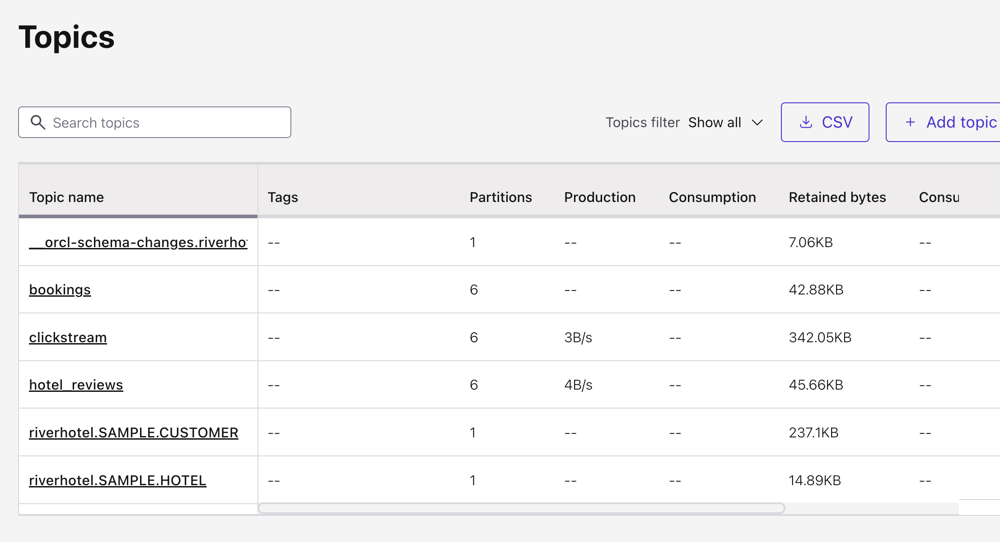

## 🏁 Conclusion

🎉 **Congratulations!** You've successfully built the complete infrastructure foundation for River Hotels' AI-powered marketing pipeline!

### What You've Achieved

In this lab, you have:

✅ **Deployed Production-Scale Infrastructure**: Provisioned 40+ cloud resources across three platforms using Infrastructure as Code
✅ **Established Real-Time Data Capture**: Set up Oracle XStream CDC to stream database changes instantly
✅ **Validated Multi-Cloud Integration**: Confirmed that AWS, Confluent Cloud, and Databricks are properly connected and secured

### Your Data Foundation

You now have a robust data platform consisting of:

- **1,000 customer profiles** with basic contact information
- **30 hotel properties** across 9 countries with amenities
- **3,000+ historical clickstream events** showing customer browsing behavior
- **400+ booking transactions** with customer-hotel relationships
- **200+ hotel reviews** with ratings and feedback
- **Continuous streaming data** with potentially realistic throttling patterns

## ➡️ What's Next

Your epic Confluent + Databricks journey continues in **[LAB 2: Confluent](./LAB2_confluent.md)** where you will:

1. **Build Intelligent Stream Processing**: Use Flink SQL to identify high-value prospects and enrich customer profiles with AI-powered review summaries
2. **Create Data Products**: Transform raw streams into business-ready datasets that drive marketing decisions
3. **Enable Delta Lake Integration**: Set up Tableflow to automatically sync your processed streams as Delta tables for analytics

## 🔧 Troubleshooting

You can find potentially common issues and solutions or workarounds in the [Troubleshooting](./troubleshooting.md) guide.
