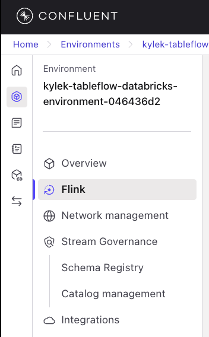
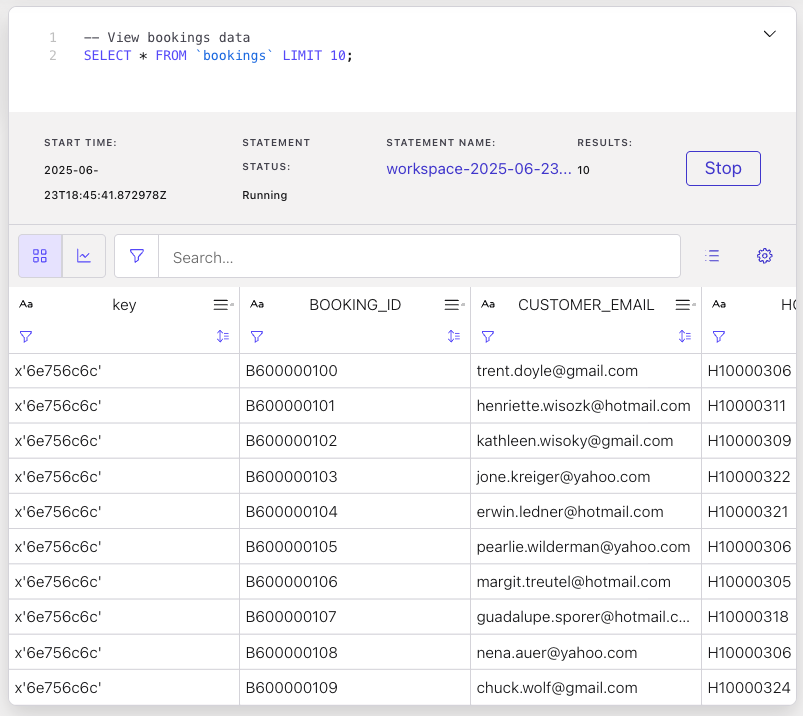
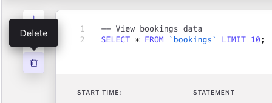
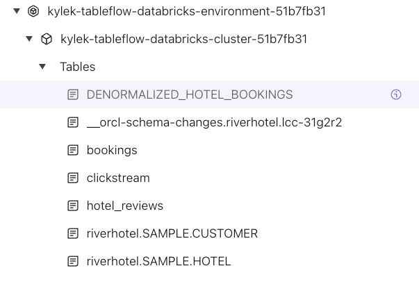
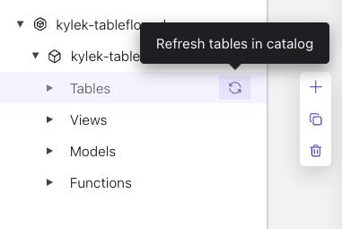
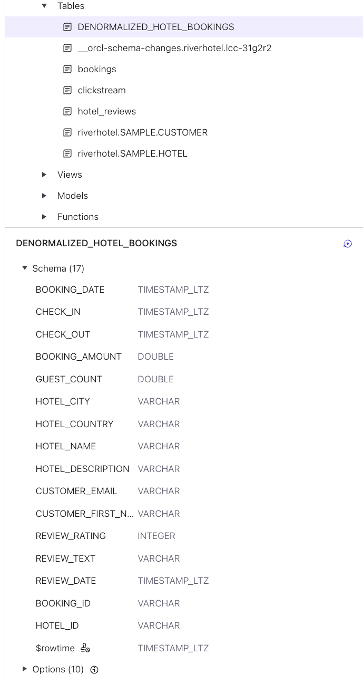
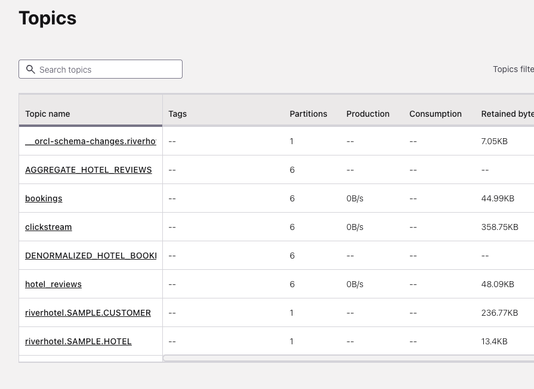
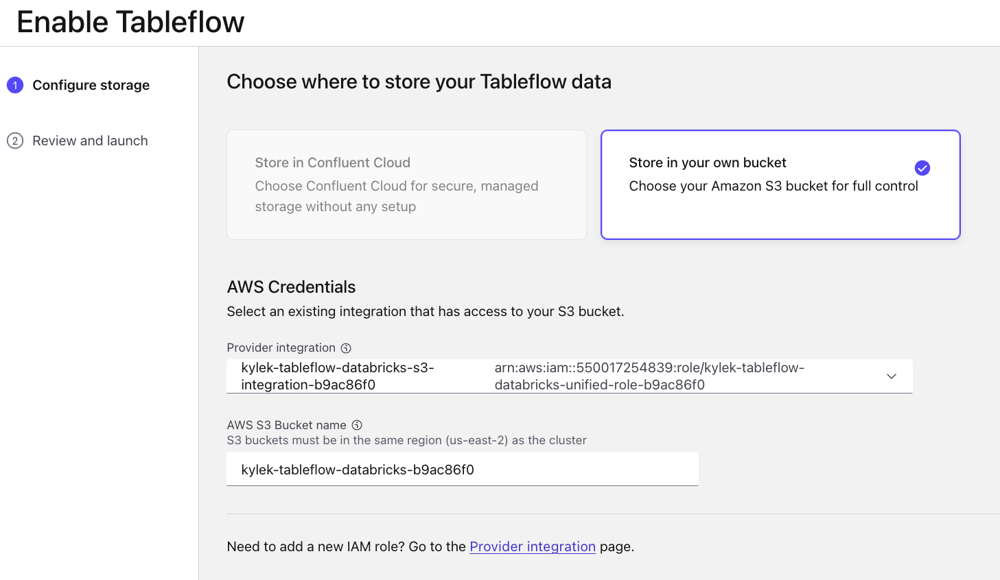
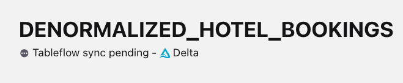

# LAB 2: Stream Processing and Data Enrichment

## 🗺️ Overview

This lab transforms your raw data streams into intelligent, enriched data products using Confluent Cloud's streaming platform. You'll build sophisticated real-time processing pipelines that identify high-value customers and enhance their profiles with generated insights.

### What You'll Accomplish

By the end of this lab, you will have:

1. **Intelligent Stream Processing**: Build Flink SQL queries that identify prospects who clicked but didn't book and enrich their profiles
2. **Data Product Creation**: Create denormalized datasets that combine customer, booking, and hotel data for analytics
3. **Delta Lake Integration**: Use Confluent Tableflow to sync processed data streams as Delta tables in S3

### Key Technologies You'll Use

- **Apache Flink SQL**: Stream processing and real-time analytics
- **Confluent Tableflow**: Automatic streaming to Delta Lake format
- **Delta Lake**: Open-source storage layer for reliable data lakes

### Prerequisites

- Completed [workshop prerequisites](../../README.md#prerequisites)
- Completed [LAB 1](./LAB1_terraform_datagen.md) with all cloud resources deployed

## 👣 Steps

### Step 1: Process Data Streams with Flink SQL

The next step in your journey is to enrich your *data streams* with serverless Apache Flink on Confluent.

#### Navigate to Flink Compute Pool

Follow these steps to navigate to the *Flink Compute Pool* that you spun up earlier with Terraform:

1. Click on your workshop environment link
2. Click on the `Flink` menu item in the left-side navigation

   

3. Click on the `Open SQL workspace` button in your workshop Flink compute pool

   

4. Ensure your workspace environment and cluster are both selected in the `Catalog` and `Database` dropdowns at the top of your compute pool screen
5. Drill down in the left navigation to see the tables in your environment and cluster

   

#### Explore Data

Now that you are in the Flink SQL workspace, you can start executing queries and statements to enhance your River Hotels data streams.

Start by reviewing the `booking` topic data with these steps:

1. Copy and paste this query into the cell:

```sql
-- View bookings data
SELECT * FROM `bookings` LIMIT 10;
```

2. Click the *Run* button

3. Look for the cell to expand at the bottom to show you the result set, which should look similar to this:

   

   Some observations about this data stream:

   - The date fields of `CHECK_IN`, `CHECK_OUT`, and `CREATED_AT` all have timestamp values that are not human friendly
   - While you can see the Hotel IDs, it would be more informative to have most of the other hotel fields displayed as well
   - It would be useful to know if a customer completed a review of their hotel stay

4. Click the *Stop* button
5. Click the *+* button in the in the narrow side panel at the top left of the cell to create a new one. Create ~10 new cells as you will need them throughout
6. Delete the current cell by clicking the trash icon located below the *+*

   

#### Streaming Data

Execute these steps to see how the `bookings` data continues to stream in from the data generator:

1. Copy and paste this query into the next empty cell

```sql
-- See streaming count of bookings data
SELECT COUNT(*) FROM `bookings` AS `TOTAL_BOOKINGS`;
```

2. Click the *Run* button

3. Pay attention to the count - over the next few minutes it should increase gradually as new booking data is produced to the `bookings` topic and surfaced in this table

#### Denormalize the Data

At this time you have normalized topics as tables in Flink. Normalization makes sense for maintaining data, but you're interested in processing it into useful datasets for data analysis use cases.

The query below creates a denormalized topic/table that combines booking data with customer information, hotel details, and any existing hotel reviews.

Copy and paste it into a cell and execute it.

```sql
SET 'client.statement-name' = 'denormalized-hotel-bookings';

CREATE TABLE DENORMALIZED_HOTEL_BOOKINGS AS (

SELECT
  h.`NAME` AS `HOTEL_NAME`,
  h.`DESCRIPTION` AS `HOTEL_DESCRIPTION`,
  h.`CLASS` AS `HOTEL_CLASS`,
  h.`CITY` AS `HOTEL_CITY`,
  h.`COUNTRY` AS `HOTEL_COUNTRY`,
  b.`PRICE` AS `BOOKING_AMOUNT`,
  b.`OCCUPANTS` AS `GUEST_COUNT`,
  to_timestamp_ltz(b.`CREATED_AT`, 3) AS `BOOKING_DATE`,
  to_timestamp_ltz(b.`CHECK_IN`, 3) AS `CHECK_IN`,
  to_timestamp_ltz(b.`CHECK_OUT`, 3) AS `CHECK_OUT`,
  c.`EMAIL` AS `CUSTOMER_EMAIL`,
  c.`FIRST_NAME` AS `CUSTOMER_FIRST_NAME`,
  hr.`REVIEW_RATING`,
  hr.`REVIEW_TEXT`,
  to_timestamp_ltz(hr.`CREATED_AT`, 3) AS `REVIEW_DATE`,
  b.`BOOKING_ID`,
  h.`HOTEL_ID`
FROM `bookings` b
   JOIN `riverhotel.SAMPLE.CUSTOMER` c ON c.`EMAIL` = b.`CUSTOMER_EMAIL`
   JOIN `riverhotel.SAMPLE.HOTEL` h ON h.`HOTEL_ID` = b.`HOTEL_ID`
   LEFT JOIN `hotel_reviews` hr ON hr.`BOOKING_ID` = b.`BOOKING_ID`
);
```

Run this query to see 20 records from this table:

```sql
SELECT *
  FROM `DENORMALIZED_HOTEL_BOOKINGS`
LIMIT 20;
```

Some observations from the data:

- Because of the `LEFT JOIN` on `hotel_reviews`, there are many hotels that have bookings but no customer reviews
- The `CHECK_IN`, `CHECK_OUT`, and `BOOKING_DATE`, and `REVIEW_DATE` are now human readable and immediately useful

#### Review Table Schema and Details

Now look into the details of the table by reviewing the table schema in the left side navigation:

1. Find and drill down into your workshop environment and cluster in the resource tree in the left menu
2. Click on the *Tables* menu item to expand it
3. Verify that you see a list of your tables, including the recently-created `DENORMALIZED_HOTEL_BOOKINGS`, show up in the list:

   

> [!TIP]
> **Refresh Tables**
>
> Hover over the *Tables* left menu item to reveal a sync icon. Click it to refresh any new tables into the UI.
>
> 

4. Click on `DENORMALIZED_HOTEL_BOOKINGS` to reveal *Schema* and *Options* data display in the bottom panel

   

#### Combine Reviews by Hotel

Execute this statement to create a table that concatenates all reviews at the hotel level.

```sql
SET 'client.statement-name' = 'aggregate-hotel-reviews';

CREATE TABLE AGGREGATE_HOTEL_REVIEWS AS (
   SELECT
      COALESCE(HOTEL_ID, 'UNKNOWN_HOTEL') AS HOTEL_ID,
      HOTEL_NAME,
      HOTEL_CITY,
      HOTEL_COUNTRY,
      HOTEL_DESCRIPTION,
      AVG(REVIEW_RATING) AS AVERAGE_REVIEW_RATING,
      COUNT(REVIEW_RATING) AS REVIEW_COUNT,
      ARRAY_JOIN(ARRAY_AGG(REVIEW_TEXT), '||| ') AS HOTEL_REVIEWS
   FROM `DENORMALIZED_HOTEL_BOOKINGS`
   GROUP BY HOTEL_ID,
      HOTEL_NAME, HOTEL_CITY,
      HOTEL_COUNTRY,
      HOTEL_DESCRIPTION
);
```

Look through the data by invoking this query:

```sql
SELECT * FROM AGGREGATE_HOTEL_REVIEWS;
```

Some observations from the data:

- Fields like `AVERAGE_REVIEW_RATING` and `REVIEW_COUNT` provide more context and analytical insight into individual hotels
- Hovering over the `HOTEL_REVIEWS` column displays all of the reviews for that hotel, making it much easier to learn what customers are saying about it

**Time for Analytics:**

Now that you have created enriched datasets, you can now more easily derive insights from them with powerful analytical platforms like Databricks.

Continue on with the next section to get start streaming your topics as Delta tables with TableFlow.

### Step 2: Enable Tableflow

Your next step is to send your enriched dataset `DENORMALIZED_HOTEL_BOOKINGS` and your `clickstream` topic to Databricks via **Tableflow**.

> [!IMPORTANT]
> **Append Changelog Mode**
>
> Since Tableflow [currently supports](https://docs.confluent.io/cloud/current/topics/tableflow/overview.html#limitations-in-open-preview) *append-only* tables, you need to alter the [changelog mode](https://docs.confluent.io/cloud/current/flink/reference/statements/create-table.html#changelog-mode) to `append` for the topics you want to stream as Delta Lake tables by executing these statements individually in a Flink cell:
>
> ```sql
>ALTER TABLE `DENORMALIZED_HOTEL_BOOKINGS` SET ('changelog.mode' = 'append');
> ```
>
> The *clickstream* table is already set to `append`, so you don't have to take any action there.

These steps guide you through enabling Tableflow for your `clickstream` and `DENORMALIZED_HOTEL_BOOKINGS` topics:

1. Click on the Environments icon in the far left sidebar
2. Click on your workshop environment
3. Click on your workshop cluster
4. Click on *Topics*

   Your Topics should looks something like:
   

5. Locate the row of your newly-created `DENORMALIZED_HOTEL_BOOKINGS` topic
6. Click on the *Enable Tableflow* link under the *Tableflow* column
7. Select the *Delta* tile

   

8. Click on the *Configure custom storage* button
9. Select the *Store in your own bucket* option
10. Select the *tableflow-databricks* provider integration from the dropdown
11. In your command-line interface in the *terraform* directory run `terraform output aws_s3`
12. Copy the value from the `name` property and paste it into the *AWS S3 Bucket name* textbox

    Your selections should look like this:
    

13. Click on the *Continue* button
14. Review the configuration details and click the *Launch* button
15. Verify Tableflow is successfully syncing data by checking the status in the UI.

   

16. Repeat steps 5-15 for the `clickstream` topic

> [!IMPORTANT]
> **Tableflow Sync Startup Time**
>
> It should take only a few minutes for Tableflow to connect to S3 and begin streaming your topics as tables.
>
> However, in some cases it may take longer, and you will see a *Tableflow sync pending* message like this:
> 
>
> While this sync is pending, you can move on to the next lab but you will not be able to pull in data until the sync is successful.

## 🏁 Conclusion

🎉 **Outstanding achievement!** You've successfully built a sophisticated real-time streaming pipeline that transforms raw customer data into enriched insights ready for analytics.

### Your Achievements

✅ **Real-Time Data Integration**: Oracle XStream connector now streams customer and hotel data changes automatically to Confluent Cloud

✅ **Intelligent Stream Processing**: Your Flink SQL queries automatically process and denormalize customer, booking, and hotel data in real-time

✅ **Data Product Creation**: A denormalized datasets now combine customer, booking, and hotel information for comprehensive analysis

✅ **Production-Ready Data Products**: Multiple enriched streaming tables now flow continuously to Delta Lake, ready for advanced analytics

### Business Impact

Your streaming pipeline now enables River Hotels to:

- Capture and process customer interactions in real-time
- Automatically enrich customer profiles with comprehensive booking and hotel data

### ✅ Solution Requirements Fulfilled

- **🔓 Unlock** - Teams can now access real-time enriched data through Delta Lake tables for immediate analytics
- **💫 Data Freshness** - Data processing latency reduced from days to minutes
- **⏱️ Operational Efficiency** - Automated data pipelines eliminate manual batch processing delays
- **🏆 Competitive Advantage** - Real-time insights enable immediate response to customer behavior patterns
- **📊 Data Product Creation** - Hotel bookings and reviews are now denormalized and aggregated, providing comprehensive insights for sales and marketing teams

## ➡️ What's Next

Continue your journey with [LAB 3](./LAB3_databricks.md), where you'll transform these streaming data products into actionable business intelligence and AI-generated marketing campaigns using Databricks' advanced analytics platform.
