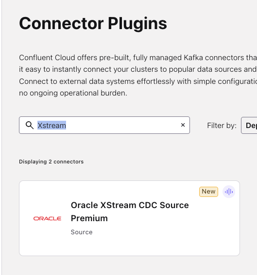
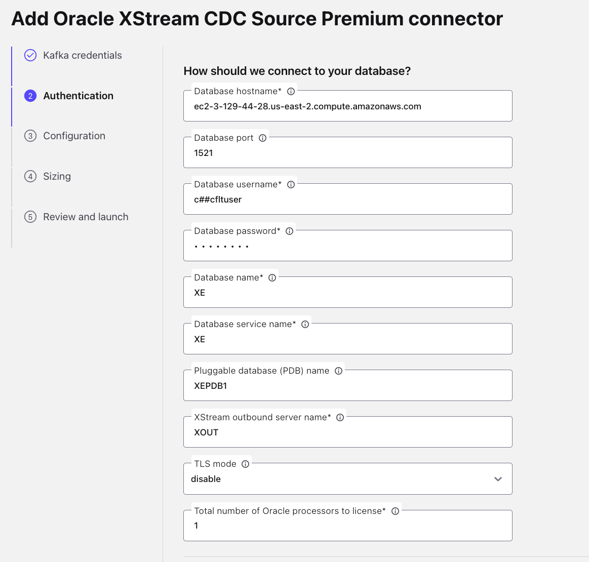
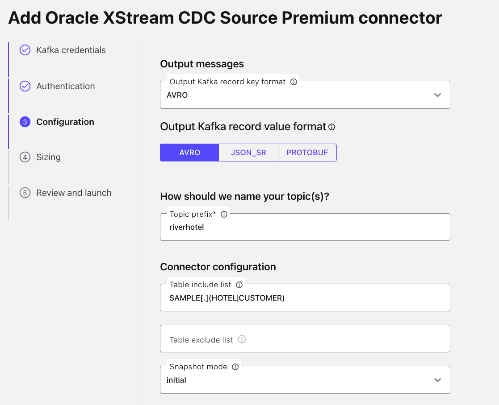
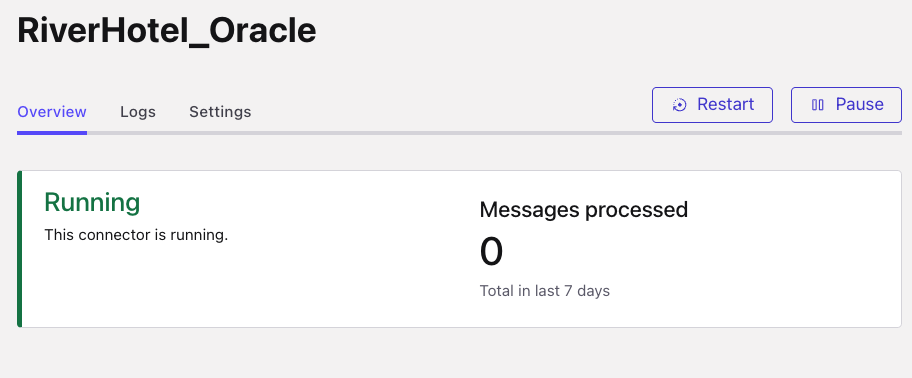
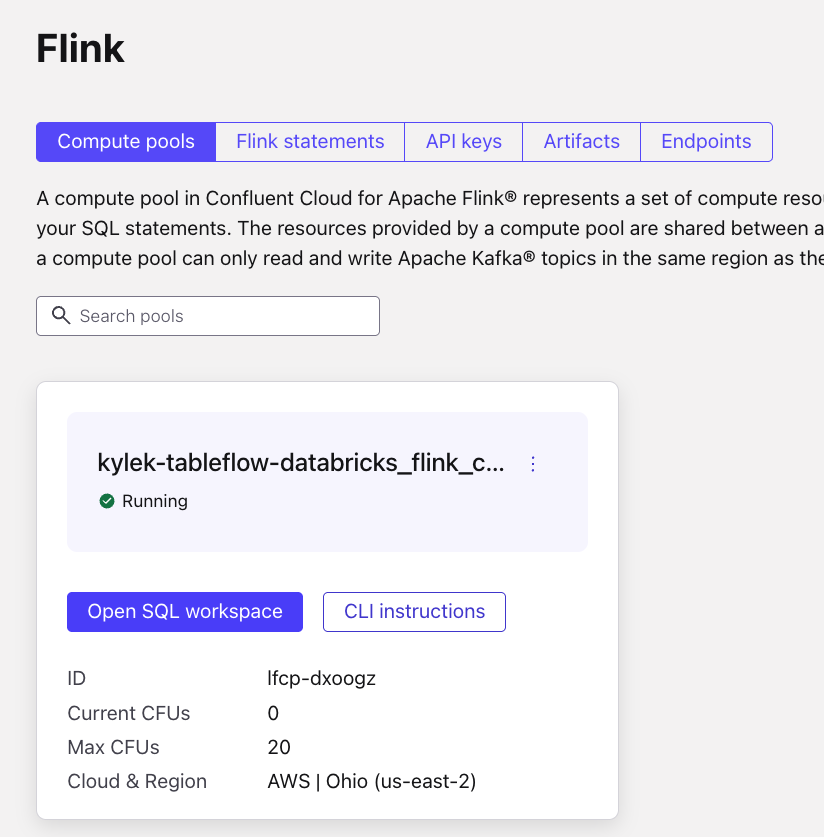
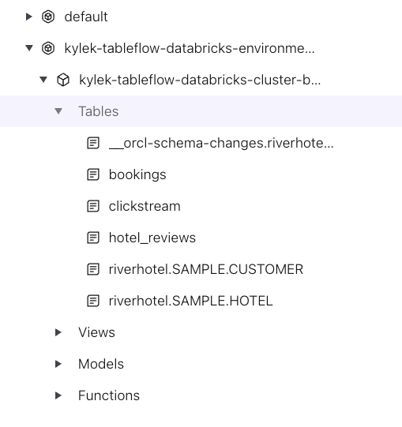
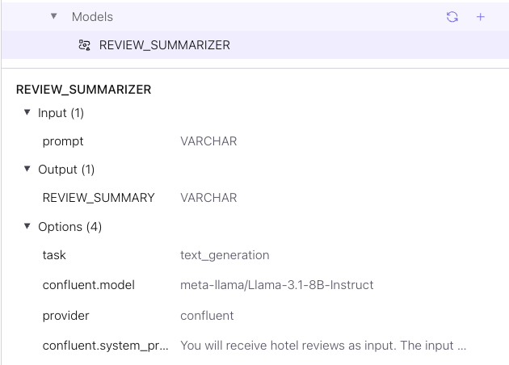
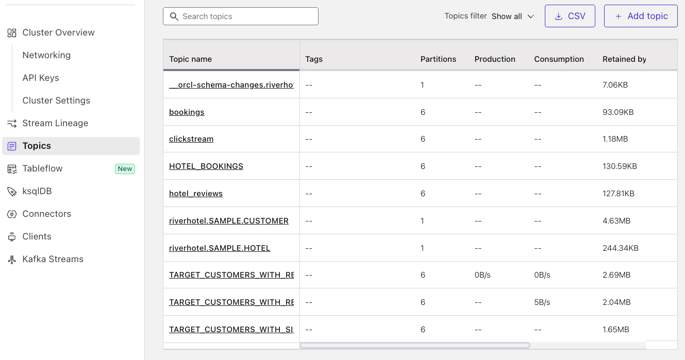
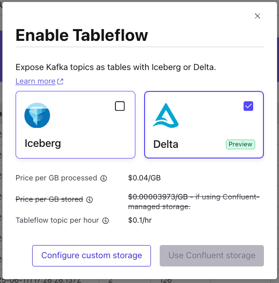
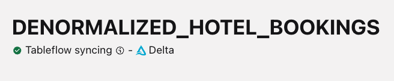

# Confluent Cloud

## Overview

Welcome to the heart of your real-time data processing pipeline! In this lab, you'll transform raw data streams into intelligent, AI-enriched data products using Confluent Cloud's powerful streaming platform.

### What You'll Accomplish

By the end of this lab, you will have:

1. **Intelligent Stream Processing**: Build sophisticated Flink SQL queries that identify high-value prospects (customers who clicked but didn't book) and enrich their profiles with contextual data
2. **AI-Powered Data Enrichment**: Deploy Large Language Models within your streaming pipeline to automatically summarize hotel reviews and create actionable customer insights
43 **Seamless Delta Lake Integration**: Use Confluent Tableflow to automatically sync your processed data streams as Delta tables in S3, ready for analytics

## Steps

### Step 1: Set Up Oracle XStream Connector

Now it's time to pull in our data from Oracle into Confluent Cloud by following these steps to set up the Oracle XStream Connector!

#### Navigate to the Oracle XStream Connector

1. Log into your [Confluent Cloud](https://confluent.cloud/login) account
2. Click on your workshop environment
3. Click on your workshop cluster
4. Click on *Connectors* in the left sidebar menu
5. Type `XStream` in the *search* text field
6. Select the `Oracle XStream CDC Source Premium` tile (it has the Oracle logo on it)



#### Generate API Key for Connector

1. Select the `My account` tile
2. Click the `Generate API key and download` button **Note:** If you too many existing API keys this will fail; remove any unused keys if this occurs
3. Click the `Continue` button - **Note:** These API keys do not need to be saved as they will automatically be assigned to the cluster

#### Configure Connection and Authentication

Run this Terraform command in your shell to show the values needed to connect and authenticate the Oracle XStream Connector.

```sh
terraform output oracle_xstream_connector
```

Now copy and paste the corresponding values into the text boxes:

1. Enter the `database_hostname` Terraform output into the `Database hostname` textbox
2. Enter the `database_port` Terraform output into the `Database port` textbox
3. Enter the `database_username` Terraform output into the `Database username` textbox
4. Enter the `database_password` Terraform output into the `Database password` textbox
5. Enter the `database_name` Terraform output into the `Database name` textbox
6. Enter the `database_service_name` Terraform output into the `Database service name` textbox
7. Enter the `pluggable_database_name` Terraform output into the `Pluggable database (PDB) name` textbox
8. Enter the `xstream_outbound_server` Terraform output into the `XStream outbound server name` textbox
9. Enter the `1` into the `Total number of Oracle processors to license` textbox

   Your screen should look similar to this:
   

10. Click the `Continue` button on the bottom right

#### Configure Message Formatting and Tables

1. Select `AVRO` on the *Output Kafka record key format* dropdown
2. Select `AVRO` from the *Output Kafka record value format* options
3. Enter `riverhotel` into the *Topic prefix* textbox
4. Enter `SAMPLE[.](HOTEL|CUSTOMER)` into the *Table include list* textbox

    Your screen should look like this:
    

5. Click the `Continue` button

#### Complete the Connector Configuration

1. Enter `1` into the *Max tasks* textbox
2. Click the `Continue` button
3. Configure Connector Name - enter any name you like in the *Connector name* textbox
4. Click the `Continue` button
5. Wait for the connector to initialize; this could take ~5 minutes; The connector tile will show **Running** status when it is ready



Well done! You have successfully configured change data capture for all events on the database tables `CUSTOMER` & `HOTEL`, which will automatically be recorded to the corresponding Kafka topics `riverhotel.SAMPLE.CUSTOMER` & `riverhotel.SAMPLE.HOTEL`

Now that we have data generating to our Oracle database and Kafka topics, let's move on to the next step!

### Step 2: Create Flink SQL Queries for Data Processing

The next step in your journey is to convert our *data streams* into **data products** using Flink to process and enrich it by following these steps:

1. Login to your Confluent Cloud account and click on your workshop environment
2. Click on the `Flink` menu item in the left-side navigation
3. Click on the `Open SQL workspace` button in your workshop Flink compute pool
   
4. Ensure your workspace environment and cluster are both selected in the `Catalog` and `Database` dropdowns at the top of your compute pool screen
5. Drill down in the left navigation to see the tables in your environment and cluster
   
6. Check out some of the data you've ingested into Confluent Cloud by executing these queries:

   ```sql
   -- View bookings data
   SELECT * FROM `bookings` LIMIT 10;
   ```

   ```sql
   -- View clickstream data
   SELECT * FROM `clickstream` LIMIT 10;
   ```

   ```sql
   -- View hotel_reviews data
   SELECT * FROM `hotel_reviews` LIMIT 10;
   ```

7. Now, create a table that identifies target customers who clicked on a hotel but didn't book within 20 minutes:

   ```sql
   SET 'client.statement-name' = 'target-customers-materializer';

   CREATE TABLE TARGET_CUSTOMERS_WITH_SIMILAR_HOTELS
   AS (
   SELECT
   TARGET_CUSTOMERS.CUSTOMER_EMAIL AS CUSTOMER_EMAIL,
   TARGET_CUSTOMERS.HOTEL_ID AS HOTEL_ID,
   TARGET_CUSTOMERS.ACTIVITY_TIME AS ACTIVITY_TIME,
   COALESCE(HOTELS.`NAME`, 'Unknown') AS HOTEL_NAME,
   HOTELS.`CITY` AS HOTEL_CITY,
   HOTELS.`AMENITIES` AS HOTEL_AMENITIES,
   ARRAY_AGG(OTHER_HOTELS.`NAME`) AS SIMILAR_HOTELS
   FROM
   (
   SELECT
      CLICKSTREAM.CUSTOMER_EMAIL,
      CLICKSTREAM.HOTEL_ID,
      CLICKSTREAM.`$rowtime` as ACTIVITY_TIME
   FROM `clickstream` CLICKSTREAM
   LEFT JOIN `bookings` BOOKINGS
      ON CLICKSTREAM.`CUSTOMER_EMAIL` = BOOKINGS.`CUSTOMER_EMAIL`
      AND BOOKINGS.`$rowtime` BETWEEN CLICKSTREAM.`$rowtime` AND CLICKSTREAM.`$rowtime` + INTERVAL '20' MINUTE
   WHERE CLICKSTREAM.`ACTION` = 'booking-click'
   GROUP BY CLICKSTREAM.CUSTOMER_EMAIL, CLICKSTREAM.HOTEL_ID, CLICKSTREAM.`$rowtime`
   HAVING COUNT(BOOKINGS.CUSTOMER_EMAIL) = 0
   ) TARGET_CUSTOMERS
   JOIN `riverhotel.SAMPLE.HOTEL` as HOTELS
   ON TARGET_CUSTOMERS.HOTEL_ID = HOTELS.`HOTEL_ID`
   LEFT JOIN `riverhotel.SAMPLE.HOTEL` as OTHER_HOTELS
   ON HOTELS.`CITY` = OTHER_HOTELS.`CITY`
   AND HOTELS.`AMENITIES` = OTHER_HOTELS.`AMENITIES`
   AND HOTELS.`HOTEL_ID` <> OTHER_HOTELS.`HOTEL_ID`
   GROUP BY
   TARGET_CUSTOMERS.CUSTOMER_EMAIL,
   TARGET_CUSTOMERS.HOTEL_ID,
   TARGET_CUSTOMERS.ACTIVITY_TIME,
   HOTELS.`NAME`,
   HOTELS.`CITY`,
   HOTELS.`AMENITIES`
   );
   ```

8. Query the table to review the results

   ```sql
   SELECT * FROM `TARGET_CUSTOMERS_WITH_SIMILAR_HOTELS` LIMIT 10;
   ```

9. Create a table that joins target customers with hotel reviews

   ```sql
   SET 'client.statement-name' = 'target-customers-with-reviews-materializer';

   CREATE TABLE TARGET_CUSTOMERS_WITH_REVIEWS_AND_HOTELS
   AS (
   SELECT
      TARGET_CUSTOMERS.CUSTOMER_EMAIL,
      TARGET_CUSTOMERS.HOTEL_ID,
      TARGET_CUSTOMERS.ACTIVITY_TIME,
      COALESCE(TARGET_CUSTOMERS.HOTEL_NAME, 'Unknown') AS HOTEL_NAME,
      COALESCE(TARGET_CUSTOMERS.HOTEL_CITY, 'Unknown') AS HOTEL_CITY,
      TARGET_CUSTOMERS.SIMILAR_HOTELS,
      TARGET_CUSTOMERS.HOTEL_AMENITIES,
      ARRAY_JOIN(ARRAY_AGG(HOTEL_REVIEWS.REVIEW_TEXT), '||| ') AS HOTEL_REVIEWS
   FROM `TARGET_CUSTOMERS_WITH_SIMILAR_HOTELS` TARGET_CUSTOMERS
   JOIN `hotel_reviews` HOTEL_REVIEWS
      ON TARGET_CUSTOMERS.HOTEL_ID = HOTEL_REVIEWS.HOTEL_ID
      AND HOTEL_REVIEWS.CREATED_AT BETWEEN TARGET_CUSTOMERS.ACTIVITY_TIME - INTERVAL '1' MONTH AND TARGET_CUSTOMERS.ACTIVITY_TIME
   GROUP BY
      TARGET_CUSTOMERS.CUSTOMER_EMAIL,
      TARGET_CUSTOMERS.HOTEL_ID,
      TARGET_CUSTOMERS.ACTIVITY_TIME,
      TARGET_CUSTOMERS.HOTEL_NAME,
      TARGET_CUSTOMERS.HOTEL_CITY,
      TARGET_CUSTOMERS.HOTEL_AMENITIES,
      TARGET_CUSTOMERS.SIMILAR_HOTELS
   );
   ```

   <!-- TODO: Add details here as to what and why -->
   You need to alter the [changelog mode](https://docs.confluent.io/cloud/current/flink/reference/statements/create-table.html#changelog-mode) to `append`:

   ```sql
   ALTER TABLE `TARGET_CUSTOMERS_WITH_REVIEWS_AND_HOTELS` SET ('changelog.mode' = 'append');
   ```

10. Set up the LLM model for review summarization

   ```sql
      CREATE MODEL REVIEW_SUMMARIZER
      INPUT(prompt STRING)
      OUTPUT(REVIEW_SUMMARY STRING)
      WITH (
      'provider' = 'confluent',
      'confluent.model' = 'meta-llama/Llama-3.1-8B-Instruct',
      'task' = 'text_generation',
      'confluent.system_prompt' = 'You will receive hotel reviews as input. The input may be:
      1. An empty string.
      2. A single review.
      3. Multiple reviews, delimited by `|||`.

      Your task is to summarize the reviews into a single sentence highlighting what customers liked most about the hotel. This summary will be used in an email to customers.

      - Ensure clarity and natural flow in the summary.
      - If the input is an empty string, return: **"NO REVIEWS FOUND."**
      - If there is a single review, condense it into a few words capturing the key aspect the customer appreciated. Do not reuse the same content for the summary if only a single review exists.
      - If multiple reviews are provided, merge their main points into a concise sentence that reflects what different customers liked most about the hotel.
      - Do not include how or why you made the summary.
      - Do not include any code or logic of how you created the summary.
      - Do not explain how you created the summary
      '
      );
    ```

   Review the details of the model in the left panel:

   

11. Now you can generate a streaming table with summarized reviews using the Model you just created:

   ```sql
   SET 'client.statement-name' = 'target-customers-with-reviews-summarizer';

   CREATE TABLE TARGET_CUSTOMERS_WITH_REVIEW_SUMMARY AS(
   SELECT
   CUSTOMER_EMAIL,
   HOTEL_ID,
   ACTIVITY_TIME,
   HOTEL_NAME,
   HOTEL_CITY,
   SIMILAR_HOTELS,
   HOTEL_REVIEWS,
   REVIEW_SUMMARY
   FROM `TARGET_CUSTOMERS_WITH_REVIEWS_AND_HOTELS`,LATERAL TABLE(ML_PREDICT('REVIEW_SUMMARIZER', HOTEL_REVIEWS))
    );
    ```

12. Review a subset of the results by invoking this query:

    ```sql
    SELECT * FROM `TARGET_CUSTOMERS_WITH_REVIEW_SUMMARY` LIMIT 20;
    ```

13. Now, go ahead and create a hotel_bookings table to send over to Databricks:

   ```sql
   CREATE TABLE HOTEL_BOOKINGS AS (
   SELECT
   b.BOOKING_ID,
   b.CUSTOMER_EMAIL,
   b.HOTEL_ID,
   h.`NAME` AS HOTEL_NAME,
   h.`CITY`,
   h.`COUNTRY`,
   b.CHECK_IN,
   b.CHECK_OUT,
   b.PRICE
   FROM `bookings` b
   JOIN `riverhotel.SAMPLE.HOTEL` h
   ON b.HOTEL_ID = h.`HOTEL_ID`
   );
   ```

   In a previous step you altered the *changelog mode* of a table. You need to do that again for for this table:

   ```sql
   ALTER TABLE `HOTEL_BOOKINGS` SET ('changelog.mode' = 'append');
    ```

14. Create a hotel catalog table to stream to Databricks as well.

   ```sql
   CREATE TABLE HOTEL_CATALOG AS (
      SELECT
         `HOTEL_ID`,
         `NAME`,
         `DESCRIPTION`,
         `CITY`,
         `COUNTRY`
      FROM
         `riverhotel.SAMPLE.HOTEL`
   );
   ```

   And similar to the previouse tables, alter the `changelog.mode`:

   ```sql
   ALTER TABLE `HOTEL_CATALOG` SET ('changelog.mode' = 'append');
   ```

Huzzah! You have enriched River Hotel data streams and created two new data products that you can stream as Delta tables with Tableflow!

### Step 3: Enable Tableflow

These steps guide you through enabling Tableflow for your topics.

1. Click on the Environments icon in the far left sidebar
2. Click on your workshop environment
3. Click on your workshop cluster
4. Click on *Topics*

   Your Topics should looks something like:
   

5. Click on the newly-created `HOTEL_BOOKINGS` topic
6. Click on the *Enable Tableflow* button
7. Select the *Delta* tile

   

8. Click on the *Configure custom storage* button
9. Select the *Store in your own bucket* option
10. Select the *tableflow-databricks* provider integration from the dropdown
11. In your command-line interface run `terraform output aws_s3`
12. Copy the value from the `name` property and paste it into the *AWS S3 Bucket name* textbox

    Your selections should look like this:
    

13. Click on the *Continue* button
14. Review the configuration details and click the *Launch* button
15. Verify Tableflow is successfully syncing data by checking the status in the UI.

   

> [!NOTE]
> **Tableflow Startup Time**
>
> It may take 5-10 minutes for Tableflow to connect to S3 and begin streaming your topics as tables.

16. Click on the *Monitor* tab
17. Find the *Tableflow details* tile and expand it
18. Copy the *Storage Location* to use in the next section with Databricks
19. Repeat steps 5-18 for the `hotel_reviews` and `HOTEL_CATALOG` topics

## Conclusion

🎉 **Outstanding work!** You've successfully built a robust real-time streaming pipeline that transforms raw customer data into AI-enriched insights ready for analytics.

### Your Streaming Achievements

✅ **Intelligent Customer Identification**: Your Flink SQL queries automatically detect high-value prospects who clicked but didn't book within 20 minutes

✅ **AI-Powered Review Summarization**: Large Language Models now process hotel reviews in real-time, creating concise summaries that highlight what customers love most

✅ **Production-Ready Data Products**: Two enriched streaming tables (`HOTEL_BOOKINGS` and `TARGET_CUSTOMERS_WITH_REVIEW_SUMMARY`) now flow continuously to Delta Lake

## What's Next

Continue your quest to derive more insights and create targeted social media campaigns with Databricks in [LAB 3](./LAB3_databricks.md).
