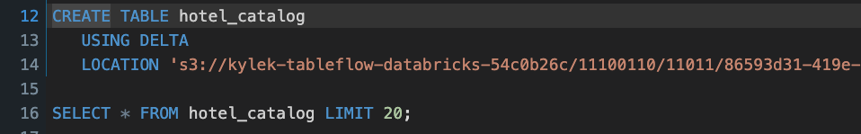
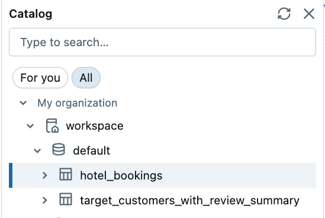
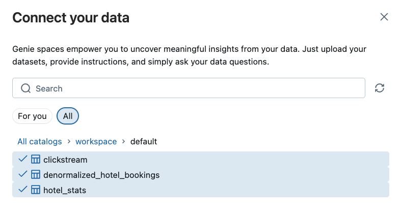
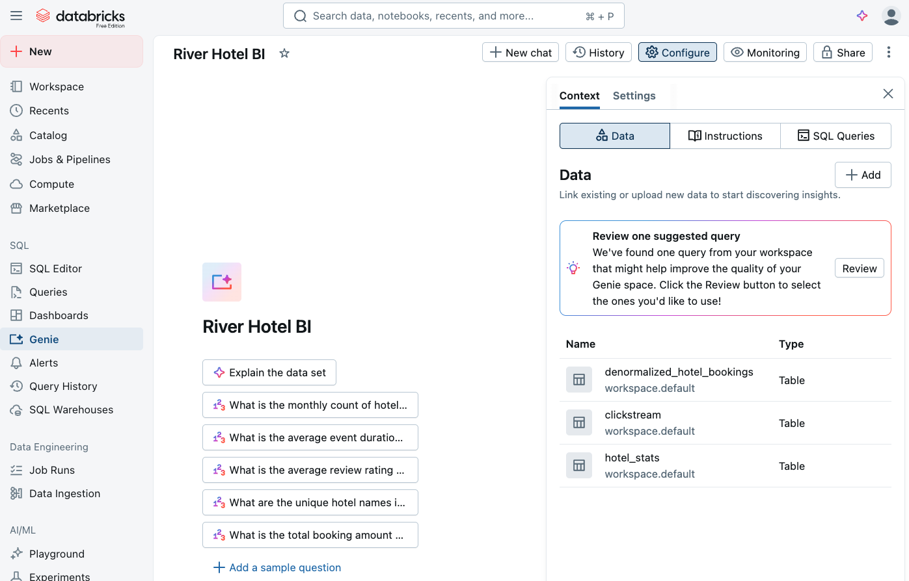
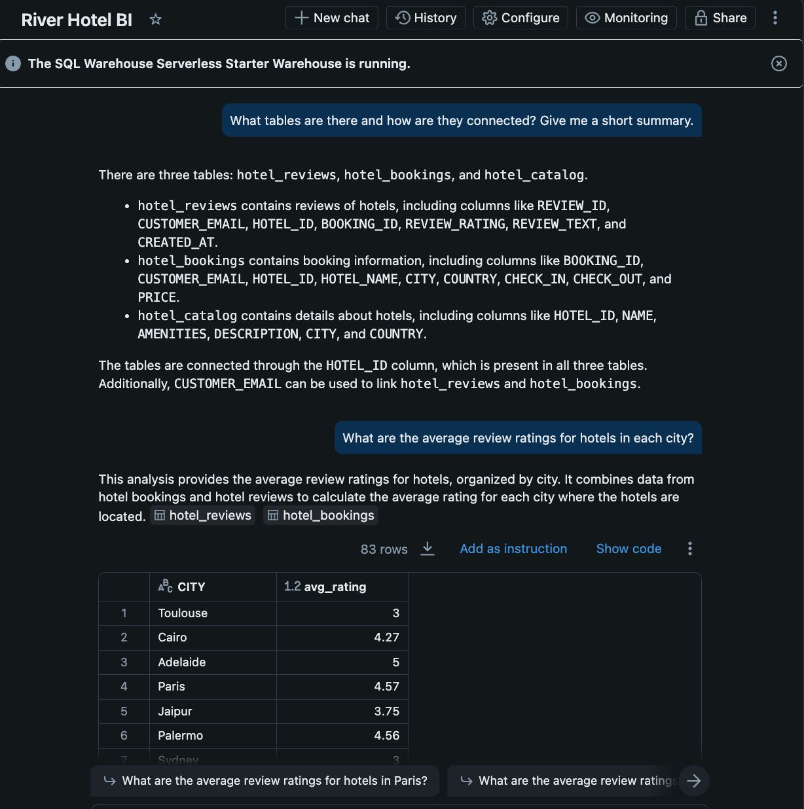
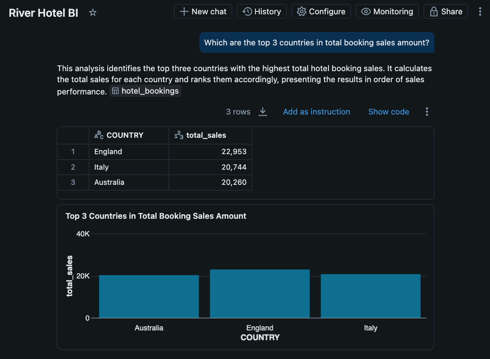
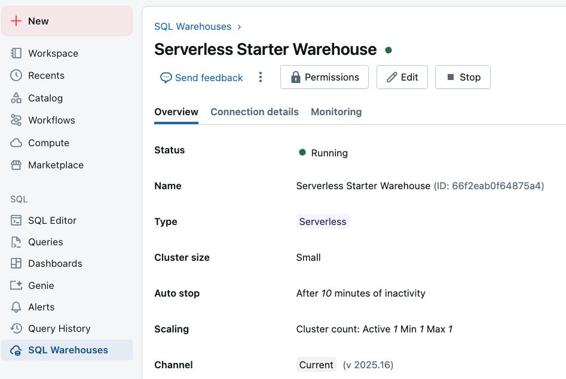

# Databricks

This is third and final lab of the Confluent Tableflow + Databricks workshop.

## Overview

Welcome to the analytics powerhouse of your real-time AI marketing pipeline! In this final lab, you'll transform your streaming dat products into actionable business insights and AI-generated marketing campaigns using Databricks' advanced analytics and AI capabilities.

### What You'll Accomplish

By the end of this lab, you will have:

1. **Delta Lake Analytics Integration**: Connect your streaming Delta tables from Confluent Tableflow to Databricks for advanced analytics and querying
2. **AI-Powered Business Intelligence**: Use Databricks Genie to generate natural language insights about customer behavior, booking patterns, and hotel performance metrics
3. **Intelligent Marketing Automation**: Deploy an AI agent that creates personalized social media campaigns based on customer reviews and preferences
4. **End-to-End Pipeline Validation**: Demonstrate a complete real-time journey from customer behavior to AI-generated marketing content

### Key Technologies You'll Experience

- **Delta Lake**: Unified analytics platform for reliable data lakes at scale
- **Databricks Genie**: Natural language interface for business intelligence and data exploration
- **AI Agents**: Automated content generation using Large Language Models
- **Databricks SQL**: High-performance analytics engine for complex queries

## Steps

### Step 1: Create Local Tables Sourced from S3 Delta Tables

1. Navigate to your Databricks workspace in a browser
2. Click on *SQL Editor* in the left navigation
3. Replace the placeholder values `<< >>` in the code block below with

    ```sql
    CREATE TABLE <<table_name>>
        USING DELTA
        LOCATION '<<S3 URI from Tableflow>>';

    SELECT * FROM <<table_name>> LIMIT 20;
    ```

    - Use these table names - `hotel_reviews`, `hotel_bookings`, and `hotel_catalog`.
    - Copy and paste the Delta table storage location in S3 that you copied previously from Confluent Cloud

4. Run the statements for each of the three tables

    You can review [these instructions](https://docs.confluent.io/cloud/current/topics/tableflow/get-started/quick-start-delta-lake.html#create-and-query-an-external-delta-lake-table) for more details.

    

5. Expand your workspace and schema (e.g. `default`) to see the new tables

    

> [!NOTE]
> **Data Sync Delay**
>
> It may take 5-10 minutes for the above `SELECT` queries to start showing data in the results.

### Step 2: Glean Data Product Insights with Genie AI/BI

In this step you will use Databricks Genie to prompt the data with natural language for high-level insights. Once you've selected a data set, Genie provides some suggested prompts and you can use them or ask your own.

Follow these steps to set Genie up:

1. Click on the *Genie* link under the *SQL* section in the left sidebar
2. Click on the *+ New+ button in the top right of the screen to create a new Genie space
3. Enter `hotel` in the search bar
4. Select all of the `hotel_*` tables

    

5. Click on the *Create* button
6. Rename your space to something like *River Hotel BI*
7. Your space should looks similar to this:

   

8. Click on one or more of the suggested prompts

    

9. Write your own questions/prompts about the datasets, like this one:

   

10. Feel free to prompt for more insights from the data with Genie.

### Step 3: Create Social Media Campaign Agent

Now you are going to generate an AI agent that will create social media posts for particular hotels based on the positive things customers have said in reviews about the hotel!

Get started by following these steps:

#### SQL Warehouse ID

Your *SQL Warehouse ID* is needed for the Notebook. Follow these steps to retrieve it:

1. Click on *SQL Warehouses* in left panel
2. Click on the warehouse where you want to execute this notebook.
   - If you don't know or are on a trial account, click on the default *Serverless Starter Warehouse*
3. Copy the ID next to the *Name* field

    

#### Import Notebook

Follow these steps to import and use a pre-built Notebook to generate your AI Agent:

1. Click on the light-red *+ New* button in the top left of the screen
2. Select *Notebook*
3. Select *File* and then *Import*
4. Upload [this file](../resources/river_hotel_social_campaign_ai_agent.ipynb)
5. Click *Import*
6. Click on the Notebook name in the success modal to navigate to it

#### Run Notebook

Go through the Notebook one step or "cell" at a time, reading through the comments and executing the code. There are notes throughout, and you can use Databricks AI assistant if you run into any issues.

At the end you should get an output of a social media post based on previous reviews!

## Conclusion

🎉 **Phenomenal achievement!** You've successfully completed the entire real-time AI-powered marketing pipeline and demonstrated the full potential of modern streaming analytics!

## What's Next

Now that you've completed the lab, it's time to clean up the resources you created by going through [Lab 4](./LAB4_tear_down.md).
