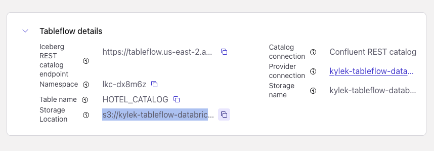
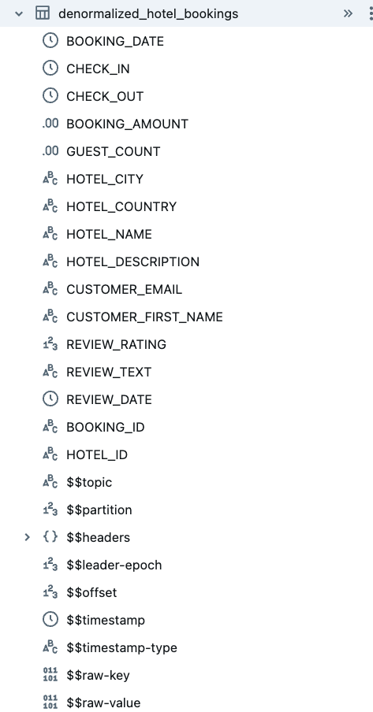
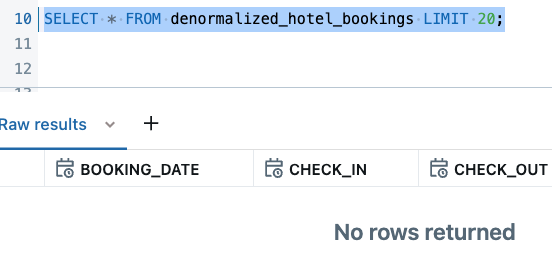
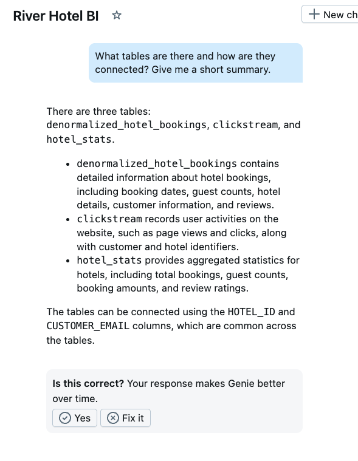
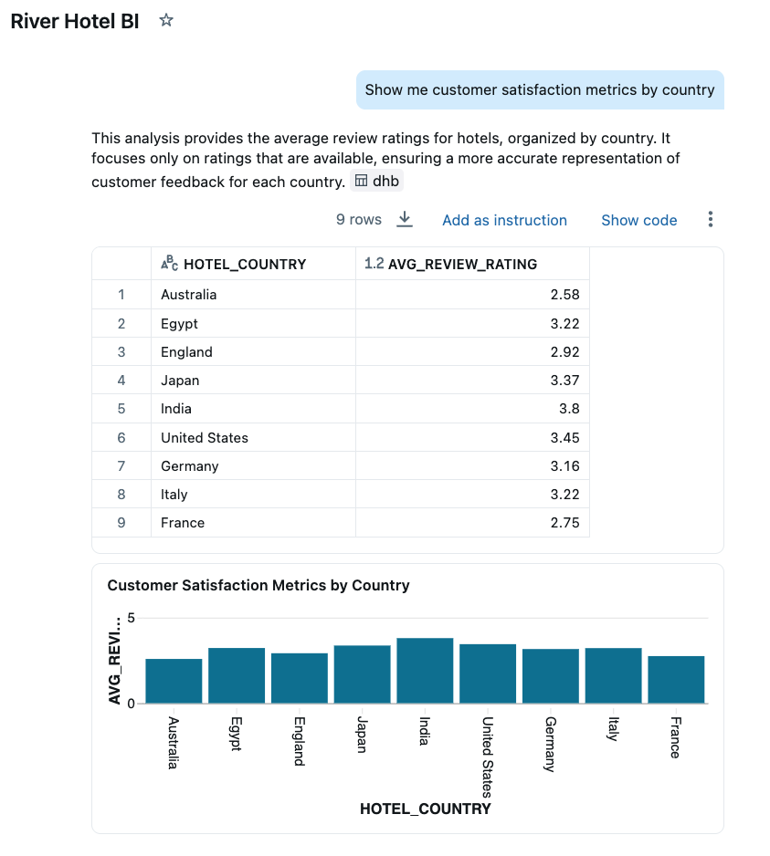
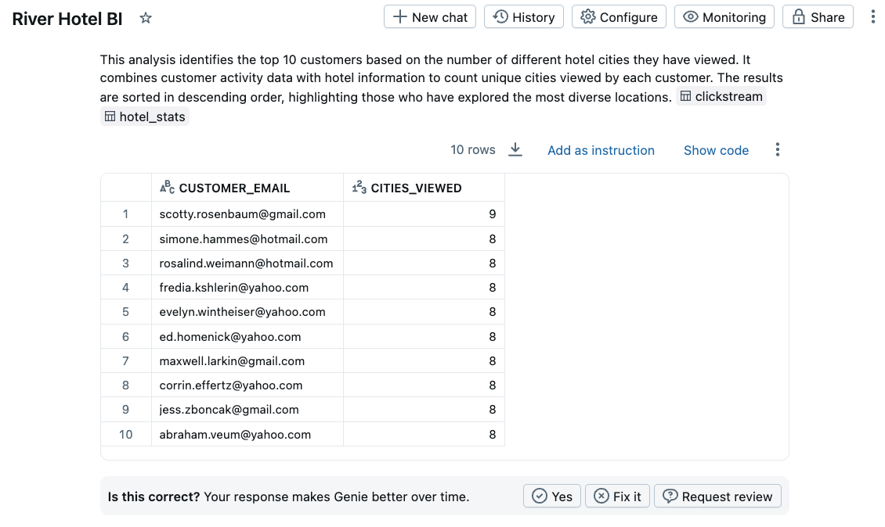
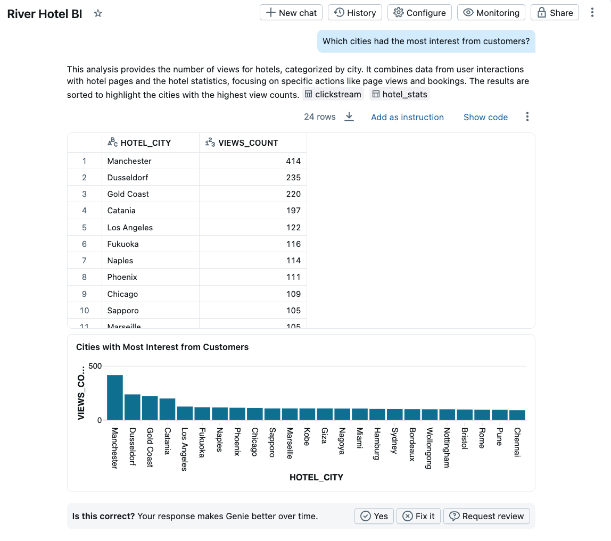
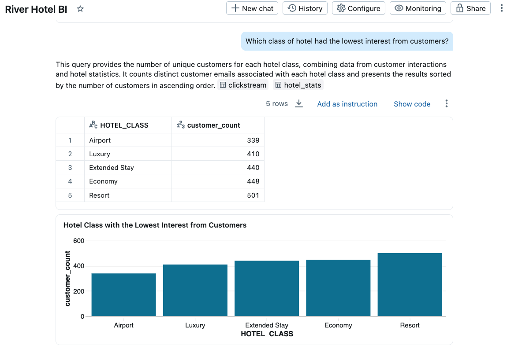
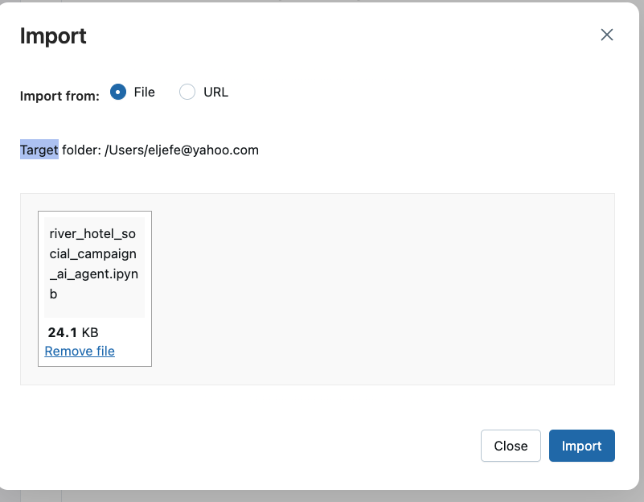

# LAB 3: Analytics and AI-Powered Marketing Automation

## 🗺️ Overview

Welcome to the analytics powerhouse of your real-time AI marketing pipeline! By following along, you will transform your streaming data products into actionable business insights and AI-generated marketing campaigns using Databricks' advanced analytics and AI capabilities.

### What You'll Accomplish

By the end of this lab, you will have:

1. **Delta Lake Analytics Integration**: Connect your streaming Delta tables from Confluent Tableflow to Databricks for advanced analytics and querying
2. **AI-Powered Business Intelligence**: Use Databricks Genie to generate natural language insights about customer behavior, booking patterns, and hotel performance metrics
3. **Intelligent Marketing Automation**: Deploy an AI agent that automatically identifies underperforming hotels with good customer satisfaction, generates personalized social media campaigns based on customer reviews, and creates targeted customer lists for marketing outreach
4. **End-to-End Pipeline Validation**: Demonstrate a complete real-time journey from customer behavior to AI-generated marketing content

### Key Databricks Technologies You'll Experience

- **Databricks SQL**: High-performance analytics engine for complex queries
- **Genie**: Natural language interface for business intelligence and data exploration
- **AI Agents**: LangChain-powered agent that combines multiple data analysis functions to automate hotel promotion and customer targeting

### Prerequisites

- Completed [workshop prerequisites](../../README.md#prerequisites)
- Completed [LAB 1](./LAB1_terraform_datagen.md) with all cloud resources deployed
- Completed [LAB 2](./LAB2_confluent.md) with Confluent streaming pipeline configured

## 👣 Steps

### Step 1: Create Local Tables Sourced from S3 Delta Tables

You'll connect your streaming Delta tables from Confluent Tableflow to Databricks for analytics and AI processing.

#### Get S3 URIs from Confluent Tableflow

First, find the S3 URIs with these steps:

1. Navigate to the *Topics* page
2. Click on one of your Tableflow-enabled topics, like `DENORMALIZED_HOTEL_BOOKINGS`
3. Click on the *Monitor* tab
4. Find the *Tableflow details* tile and expand it
5. Click the *copy* icon next to the the *Storage Location* and use in the next section

   

#### Source Tableflow Topics into Databricks as External Tables

1. Login to your Databricks workspace
2. Click on *SQL Editor* in the left navigation
3. Select the appropriate **catalog** and **database** in the editor dropdown. For those using trial or free accounts, this will likely be `workspace` and `default` respectively
4. Replace the placeholder values `<< >>` in the code block below with the actual values. Copy and paste the Delta table storage location in S3 that you copied previously from Confluent Cloud

```sql
CREATE TABLE <<table_name>>
    USING DELTA
LOCATION '<<S3 URI from Tableflow>>';
```

> [!TIP]
> **Case Insensitive Table Names**
>
> It appears that Databricks lowercases all table names, so you can paste them in from Confluent Cloud as all uppercase but they will display as all lowercase.

5. Verify the table was created successfully.  If not, review the [Databricks troubleshooting guide](./troubleshooting.md#databricks) for help.

6. Review the table schema by expanding the table in the *Catalog explorer*

   

7. Open a new SQL editor tab and repeat the steps under the [*Get S3 URIs from Confuent Tableflow*](#get-s3-uris-from-confuent-tableflow) and the preceding steps 1-6 for the `clickstream` topic

8. Run this query to see if data is available

```sql
SELECT * FROM <<table_name>> LIMIT 20;
```

> [!IMPORTANT]
> **Data Sync Delay**
>
> It may take 5-10 minutes for the above `SELECT` queries to return data in the results.
> The next big step requires that all data be
>
> 
>
> You can review the [notebook](../resources/river_hotel_targeted_marketing_ai_agent.ipynb) containing the Agentic workflow you will implement while you wait for the data to arrive.

### Step 2: Generate Hotel Stats Table

With River hotel streaming topic data now (or soon) available in your Databricks account, you can generate an additional enriched dataset of aggregated metrics for each hotel.

Open a new query window and execute this statement to create a table that calculates high-level metrics at the hotel level.

```sql
CREATE TABLE hotel_stats AS (
SELECT
COALESCE(HOTEL_ID, 'UNKNOWN_HOTEL') AS HOTEL_ID,
HOTEL_NAME,
HOTEL_CITY,
HOTEL_COUNTRY,
HOTEL_DESCRIPTION,
HOTEL_CLASS,
SUM(1) AS TOTAL_BOOKINGS_COUNT,
SUM(GUEST_COUNT) AS TOTAL_GUEST_COUNT,
SUM(BOOKING_AMOUNT) AS TOTAL_BOOKING_AMOUNT,
CAST( AVG(REVIEW_RATING) AS DECIMAL(10, 2)) AS AVERAGE_REVIEW_RATING,
SUM(CASE WHEN REVIEW_RATING IS NOT NULL THEN 1 ELSE 0 END) AS REVIEW_COUNT
FROM `denormalized_hotel_bookings`
WHERE HOTEL_ID IS NOT NULL
GROUP BY
   HOTEL_ID,
   HOTEL_NAME,
   HOTEL_CITY,
   HOTEL_COUNTRY,
   HOTEL_DESCRIPTION,
   HOTEL_CLASS
);
```

Now run this query to see this data:

```sql
SELECT * FROM hotel_stats;
```

Some key observations about this data:

- Several cities and countries have multiple hotels with varying performance metrics
- The aggregated data provides real-time insights into booking patterns and customer satisfaction

### Step 3: Derive Data Product Insights with Genie

Databricks Genie makes it more accessible and easier to obtain data insights.  It provides a chat interface where you ask questions about your data in natural language, and it leverages generative AI to parse your questions and answer them through SQL queries it generates.

#### Set Up Genie Workspace

Follow these steps to set Genie up:

1. Click on the *Genie* link under the *SQL* section in the left sidebar
2. Click on the *+ New* button in the top right of the screen to create a new Genie space
3. Click on the *All* toggle
4. Navigate to your workshop *catalog* and *database* (e.g. `workspace` and `default`)
5. Select all three of the `clickstream`, `denormalized_hotel_bookings`, and `hotel_stats` tables

   

6. Click on the *Create* button
7. Rename your space to something like *River Hotel BI*
8. Your space should look similar to this:

   

#### Generate Business Insights

Prompt Genie for insights about the data using natural language and following these steps:

> [!NOTE]
> **Example Screenshots**
>
> Throughout these next steps of prompting insights from Genie, the results depicted in the screenshots are **only examples** - the dataset
> you generate for this lab is different each time, and so these example screenshots will never fully match what you see.

Click the **Explain the data set** button to generate an output similar to this:



Now, find out how each country is doing with customer satisfaction with this prompt:
> Show me customer satisfaction metrics by country

You may see a table and chart similar to this:


You can dive into customer-centric analysis with this prompt:
> Show me customers who viewed hotels in the most cities

You should see a result similar to this:



Another prompt to try out is this:
> Which cities had the most interest from customers?

See which cities top your list, it may look similar to this:



You may continue with your own prompts or clicking on Genie-suggested ones to further learn from the data.

Executing this final prompt will provide the *class* of hotel that you will use to fulfill the Marketing weekly discount campaign:

> Which class of hotel had the lowest interest from customers?



Identify the *Hotel Class* with the lowest customer interest, you will use this in the next section to create an intelligent marketing agent.

### Step 4: Create Marketing Campaign Agent

In this section you will use a provided Jupyter Notebook to generate an AI agent that will automatically identify hotels that need promotion and create targeted marketing campaigns for them!

The AI agent combines three intelligent functions:

1. **Hotel Selection**: Automatically identifies the lowest-performing hotel in a given class that has above-average customer satisfaction (3+ reviews) - perfect candidates for promotion
2. **Content Generation**: Uses AI to analyze customer reviews and extract the top 3 reasons guests enjoyed their stay, then creates positive social media posts highlighting these strengths
3. **Customer Targeting**: Identifies customers who showed high interest (many page views/clicks) but made few bookings in that hotel class - prime targets for conversion

#### Get SQL Warehouse ID

Your *SQL Warehouse ID* is needed for the Notebook. Follow these steps to retrieve it:

1. Click on *SQL Warehouses* in the left panel
2. Click on the warehouse where you want to execute this Notebook. If you are on a *trial* or *free edition* account, then click on the default *Serverless Starter Warehouse*
3. Copy the ID next to the *Name* field

    

#### Import and Configure Notebook

Follow these steps to import and use a pre-built Notebook to generate your AI Agent:

1. Click on the light-red *+ New* button in the top left of the screen
2. Select *Notebook*
3. Select *File* and then *Import*
4. Upload [this file](../resources/river_hotel_targeted_marketing_ai_agent.ipynb)
5. Click on the *Import* button

   

6. Click on the Notebook name in the success modal to navigate to it, or find it using the *Search* bar at the top of the page

#### Execute AI Agent

Now that you have successfully imported the Notebook, Fill out these widget fields at the top of the notebook with appropriate values for your Databricks account.

Here is an example:

- **catalog:** `workspace`
- **database:** `default`
- **warehouse_id:** `77ad79eadc0d123`
- **hotel_class:** `Extended Stay`
- **hotel_to_promote**: ` `
  - Leave this one blank until later in the notebook

Start with the first cell and execute each one in succession, reading through the comments and executing the code. The notebook will guide you through:

1. **Creating SQL Functions**: Three user-defined functions that serve as tools for the AI agent
2. **Building the AI Agent**: Using LangChain and Databricks LLM endpoints to create an intelligent agent
3. **Executing the Marketing Campaign**: Running the agent to automatically identify a hotel, create marketing content, and generate a prospective customer list

> [!IMPORTANT]
> **Follow Notebook Comments**
>
> Follow the instructions in the Notebook that appear as commented out text, as they help guide you through it.

At the end you should get an output that includes:

- The name and location of the selected hotel to promote
- A positive social media marketing post highlighting the hotel's best features
- A list of 10 customer email addresses who are prime targets for the campaign

Here is an example output:


The AI agent intelligently combines customer review analysis, booking performance data, and customer behavior patterns to create data-driven marketing campaigns!

#### ✅ Solution Requirements Fulfilled

- **🤖 AI Content Generation** - AI agent now automatically creates personalized social media campaigns based on customer preferences and hotel reviews
- **🏝️ Smart Hotel Selection** - Automated identification of underperforming hotels with high customer satisfaction (perfect for promotion)
- **👥 Behavioral Analytics** - Real-time customer behavior analysis to identify high-engagement prospects (many page views/clicks, few bookings) for targeted marketing
- **🔓 Unlock** - Marketing teams can now act on insights immediately with automated campaign generation

## 🏁 Conclusion

🎉 **Phenomenal achievement!** You've successfully completed the entire real-time AI-powered marketing pipeline and demonstrated the full potential of modern streaming analytics!

### Your Achievements

✅ **Delta Lake Analytics Integration**: Successfully connected streaming Delta tables from Confluent Tableflow to Databricks for advanced analytics

✅ **AI-Powered Business Intelligence**: Used Databricks Genie to generate natural language insights about customer behavior, booking patterns, and hotel performance

✅ **Intelligent Marketing Automation**: Deployed an AI agent that automatically identifies underperforming hotels with good customer satisfaction, creates personalized social media campaigns based on customer review analysis, and generates targeted customer lists

✅ **End-to-End Pipeline Validation**: Demonstrated a complete real-time journey from customer behavior to AI-generated marketing content

### What You've Built

Your complete AI-powered marketing pipeline now:

- Captures real-time customer behavior and hotel data
- Processes and enriches streaming data with AI-generated insights
- Provides natural language business intelligence through Genie
- Automatically generates personalized marketing content using Large Language Models

#### ✅ Solution Requirements Fulfilled - Mission Accomplished!

- **💫 Data Freshness** - Reduced from week-old batch data to real-time insights (seconds to minutes)
- **⏱️ Operational Efficiency** - Eliminated manual data analysis through automation and AI-powered processing
- **🏆 Competitive Advantage** - River Hotels can now respond to market opportunities in real-time with AI-generated marketing campaigns
- **🔍 Prospect Intelligence** - Genie enables natural language queries to identify high-value prospects and conversion opportunities from real-time data
- **📈 Real-time Insights** - Natural language business intelligence provides immediate access to booking trends and customer satisfaction metrics
- **🏆 Competitive Advantage** - Sales teams can now respond to market opportunities in real-time with instant data insights through natural language queries
- **🏝️ Smart Hotel Selection** - Positive hotel reviews with ratings >= 3 are identified and enriched with AI summaries

**🏨 River Hotels is now equipped to compete effectively in the digital hospitality landscape with real-time, AI-powered marketing capabilities!**

## ➡️ What's Next

Now that you've completed the lab, it's time to clean up the resources you created by going through [LAB 4: Workshop Clean Up](./LAB4_tear_down.md).
