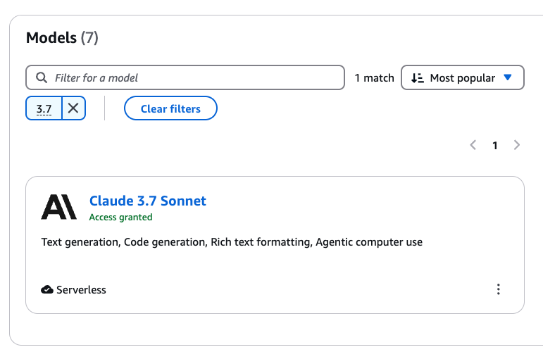
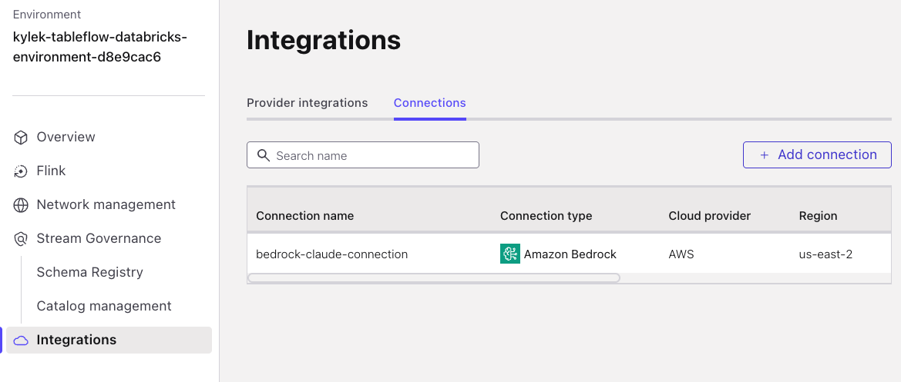
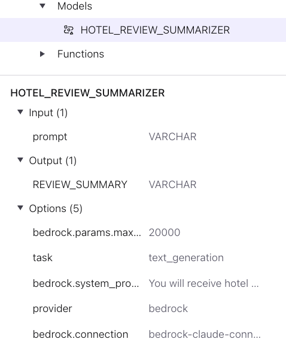

# Bedrock LLM Feature

In the original workshop, we leveraged AWS Bedrock to generate hotel review summaries for our data product.

However, due to Tabeflow not yet supporting retract/upsert `changelog.mode`, this become a non-essential step in the workshop.

Then we decided to leverage AWS Workshop Studio accounts for presenter-led hands-on workshops, and Workshop Studio accounts do not have Bedrock access in `us-east-2`, which is a cloud region we need to support.

## Terraform

These snippet should be added back to the `confluent.tf` file

```hcl
locals {
  bedrock_ai_connection_endpoint = "https://bedrock-runtime.${var.cloud_region}.amazonaws.com/model/${var.aws_bedrock_anthropic_model_id}/invoke"
}

# Due to resource limits with AWS Workshop Studio accounts in that Bedrock is only available
# in us-east-1 and us-west-2, we'll omit using this for the hands-on workkshop and add it back in later
# TODO: Add back in later

# Due to resource limits with AWS Workshop Studio accounts in that Bedrock is only available
# in us-east-1 and us-west-2, we'll omit using this for the hands-on workkshop and add it back in later
# TODO: Add back in later

resource "confluent_flink_connection" "bedrock_ai_connection" {
  organization {
    id = data.confluent_organization.current.id
  }
  environment {
    id = confluent_environment.staging.id
  }
  compute_pool {
    id = confluent_flink_compute_pool.flink-compute-pool.id
  }
  principal {
    id = confluent_service_account.app-manager.id
  }
  rest_endpoint = data.confluent_flink_region.demo_flink_region.rest_endpoint
  credentials {
    key    = confluent_api_key.app-manager-flink-api-key.id
    secret = confluent_api_key.app-manager-flink-api-key.secret
  }

  display_name      = "bedrock-claude-connection"
  type              = "BEDROCK"
  endpoint          = local.bedrock_ai_connection_endpoint
  aws_access_key    = var.aws_access_key_id
  aws_secret_key    = var.aws_secret_access_key
  aws_session_token = var.aws_session_token
}
```

And add this to the output terraform

```
Bedrock AI Model Endpoint: ${local.bedrock_ai_connection_endpoint}
```

And add this back to the `terraform.tfvars` (or sample-tfvars):

```hcl
# ===============================
# AWS Overrides
# ===============================
aws_access_key_id              = ""
aws_secret_access_key          = ""
aws_session_token              = ""
aws_bedrock_anthropic_model_id = ""

```

## LAB 1

Add this content below the [AWS account configuration section](./LAB1_terraform_datagen.md#configure-aws-account)

##### Enable Claude Sonnet 3.7 on Your AWS Account

> [!WARNING]
> ****
>
> If this is the first time requesting this model, then it can take 5-10 minutes for it to spin up.
> Keep checking on it to see when it ready.

Follow these steps to enable **Claude 3.7 Sonnet** in your AWS account via Amazon Bedrock:

1. Open the [Amazon Bedrock Console](https://console.aws.amazon.com/bedrock/home?/overview) and make sure you are in the same cloud region as your Databricks account.
2. In the left sidebar, under **Bedrock configuration**, click **Model access**.
3. Locate **Claude 3.7 Sonnet** in the list of available models.
4. Click **Available to request**, then select **Request model access**.
5. In the request wizard, click **Next** and follow the prompts to complete the request.


> [!NOTE]
> **⏱️ Provisioning May Take 5–10 Minutes**
>
> If this is the first time requesting this model, then it can take 5-10 minutes for it to spin up.
> Keep checking on it to see when it ready.

Once enabled, you'll need to retrieve the **model ID** for use in your applications.

1. In the Bedrock UI, Click on the **Providers** link under the *Getting Started* section
2. Click on the **Anthropic** tile
3. then select the **Claude Sonnet 3.7** model

   

4. Copy the **Model ID** located within the *Details* section
  The *Model ID* should look something like `anthropic.claude-3-7-sonnet-20250219-v1:0`

5. Paste this value into the `aws_bedrock_anthropic_model_id` terraform override in your `terraform.tfvars` file

6. Prefix the *Model ID* with `us.` for US-based regions or `eu.` for EU-based regions.
  The *Model ID* should then look like this: `us.anthropic.claude-3-7-sonnet-20250219-v1:0`

##### Add Access Key, Secret, and Token to Terraform

Run this command to automatically generate and export AWS session credentials as environment variables:

**Linux/Mac:**

```sh
export $(aws sts get-session-token --duration-seconds 10800 --output json | jq -r '.Credentials | "AWS_ACCESS_KEY_ID=\(.AccessKeyId)", "AWS_SECRET_ACCESS_KEY=\(.SecretAccessKey)", "AWS_SESSION_TOKEN=\(.SessionToken)"')
```

**Windows PowerShell:**

```powershell
$creds = aws sts get-session-token --duration-seconds 10800 --output json | ConvertFrom-Json
$env:AWS_ACCESS_KEY_ID = $creds.Credentials.AccessKeyId
$env:AWS_SECRET_ACCESS_KEY = $creds.Credentials.SecretAccessKey
$env:AWS_SESSION_TOKEN = $creds.Credentials.SessionToken
```

> [!WARNING]
> **Potentially Limited Session Duration**
>
> While you specified the duration of this session token for 3 hours (10,800 seconds) with the `--duration-seconds` argument, the actual duration of the session may be shorter if you are using an account that has certain limitations, such as AWS Workshop Studio account.
>
> As of this writing, the minimum duration is 1 hour (3,600 seconds), which means that you may have to try to quickly complete the remainder of this lab and LAB 2 in order to avoid hitting the expiration of your AWS token.

Save your `terraform.tfvars` file. It should look somewhat like this (these are dummy values):

<!-- Todo: NEED TO change this -->


Save the file and continue to the next step.

### Verification Steps

Add these bullet points after step 4 in [LAB 1: Verify Confluent Resources heading](./LAB1_terraform_datagen.md#verify-confluent-resources):

5. Click on the *Connections* tab
6. Notice a row named *bedrock-claude-connection*

   

## LAB 2

Add this content below the [Aggregate Hotel Reviews section](./LAB2_confluent.md#combine-reviews-by-hotel):

#### Generate Review Summarizer

> [!IMPORTANT]
> **AWS Bedrock Access Required**
>
> In order to complete these next steps your AWS account **must** have access to AWS Bedrock.
>
> If your AWS account does not have access to Bedrock then you can skip this section and [continue here](#step-3-enable-tableflow) with the remainder of the workshop.

Now with all of the hotel reviews aggregated, you are almost ready to summarize those reviews with your new `HOTEL_REVIEW_SUMMARIZER` model! The final step is to alter the `changelog.mode` on the `AGGREGATE_HOTEL_REVIEWS` table from `retract` to `append` with this statement:

```sql
ALTER TABLE AGGREGATE_HOTEL_REVIEWS SET ('changelog.mode' = 'append');
```

A neat feature in Confluent Flink is the ability to connect to external AI models and create purpose-built models to use similar as functions.

Execute this statement to create a model that summarizes many hotel reviews:

```sql
CREATE MODEL HOTEL_REVIEW_SUMMARIZER
   INPUT(prompt STRING)
   OUTPUT(REVIEW_SUMMARY STRING)
   COMMENT 'Summarize many reviews of a hotel into a single succinct review'
   WITH (
   'provider' = 'bedrock',
   'task' = 'text_generation',
   'bedrock.connection'='bedrock-claude-connection',
   'bedrock.PARAMS.max_tokens' = '20000',
   'bedrock.system_prompt' = 'You will receive hotel reviews as input. The input may be:
   1. An empty string.
   2. A single review.
   3. Multiple reviews, delimited by `|||`.

   Your task is to summarize the reviews into a single sentence highlighting what customers liked most about the hotel. This summary will be used in an email to customers.

   - Ensure clarity and natural flow in the summary.
   - If the input is an empty string, return: **"NO REVIEWS FOUND."**
   - If there is a single review, condense it into a few words capturing the key aspect the customer appreciated. Do not reuse the same content for the summary if only a single review exists.
   - If multiple reviews are provided, consolidate their main points into a concise sentence that reflects what different customers liked most about the hotel.
   - Do not include how or why you made the summary.
   - Do not include any code or logic of how you created the summary.
   - Do not explain how you created the summary
   '
);
```

Now review the details of the model in the left panel:




This is a necessary step as the `ML_PREDICT` function is non-deterministic and may experience issues with update or delete operations in streaming mode.

Now you can create a new table that condenses all reviews for a hotel using the `REVIEW_SUMMARIZER` model you created previously:

```sql
SET 'client.statement-name' = 'aggregate-hotel-reviews-with-summary';

CREATE TABLE AGGREGATE_HOTEL_REVIEWS_WITH_SUMMARY AS (
   SELECT *
   FROM
      AGGREGATE_HOTEL_REVIEWS,
      LATERAL TABLE(ML_PREDICT('HOTEL_REVIEW_SUMMARIZER', HOTEL_REVIEWS)) AS ai_summary(REVIEW_SUMMARY)
);
```

Now review some records of this AI-powered dataset:

```sql
SELECT * FROM `AGGREGATE_HOTEL_REVIEWS_WITH_SUMMARY` LIMIT 10;
```

Key observations from the data:

- The `REVIEW_SUMMARY` field succinctly describes what customers liked and didn't like about their hotel stay
- The `REVIEW_COUNT` helps contextualize the scale of the `REVIEW_SUMMARY` field

> [!WARNING]
> **Troubleshooting ML_PREDICT with Aggregations**
>
> If you encounter errors about "Table sink doesn't support consuming update and delete changes" when using ML_PREDICT with GROUP BY operations, it's because:
>
> 1. **GroupAggregate produces changelog events** (updates/deletes) as new data arrives
> 2. **ML_PREDICT requires append-only streams** for deterministic behavior
> 3. **Solution**: Create the aggregation table first, set it to append-only mode, then use it as input to ML_PREDICT
>
> This two-step approach ensures the ML model only processes stable, append-only data.
